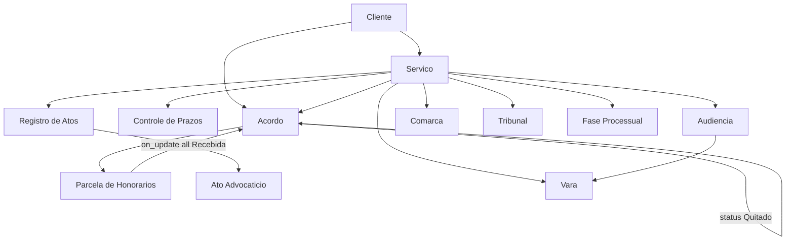

# CODEBASE2.md — App Advocacia (Frappe v16)

**Versão do app:** `0.4.0` (pyproject.toml)  
**Repositório:** https://github.com/ctomazini/advocacia  
**Branch:** `frappe-v16`  
**Bench:** `/home/frappe/frappe-bench` · **Site:** `advocacia.local`  
**Data deste documento:** 2026-05-29  
**Substitui:** `CODEBASE.md` (auditoria inicial pré-P0–P6)

Este documento descreve o **estado atual** do app após as entregas P0 (limpeza), P1 (roles/permissões), P2 (validações), P3 (DocTypes auxiliares), P4 (painel), P5 (automações) e P6 (UX polish).

---

## 1. Visão geral

### 1.1 Propósito

LegalTech para escritórios de advocacia no Brasil: gestão de **clientes**, **serviços** (processos/consultorias), **honorários** (acordos e parcelas), **atos**, **prazos**, **audiências**, **tarefas** e **documentos** (.docx), com integração opcional a **Sales Invoice** (ERPNext).

### 1.2 Stack

| Item | Valor |
|------|--------|
| Framework | Frappe v16.19.0 (nativo, sem Docker) |
| Python | ≥ 3.10 |
| Dependência app | `docxtpl>=0.18.0` |
| Módulo Frappe | **Advocacia** |
| Roles custom | `Advocacia User`, `Advocacia Manager` |

### 1.3 Convenção de paths (importante)

No disco, o código Python/JS principal vive em:

```text
apps/advocacia/advocacia/advocacia/   # pacote Python real
apps/advocacia/advocacia/hooks.py     # hooks do app
apps/advocacia/advocacia/fixtures/    # fixtures exportáveis
```

No **import Python** e em **whitelisted methods**, use sempre:

```text
advocacia.advocacia.<módulo>                    # ex.: tasks, painel_api, validators
advocacia.advocacia.doctype.<pasta>.<arquivo>   # ex.: audiencia.audiencia.get_events
```

**Não** use `advocacia.advocacia.advocacia.*` — esse path não resolve no bench.

---

## 2. Evolução por fase (P0–P6)

| Fase | Foco | Principais entregas |
|------|------|---------------------|
| **P0** | Limpeza | Remoção de código morto/duplicado; `notificacoes.py` sem `Fatura` órfão |
| **P1** | Permissões | Roles `Advocacia User/Manager`; `setup/install.py`; permissões nos DocTypes |
| **P2** | Validações | `validators.py` (CPF, CNPJ, CNJ, telefone, e-mail); `validate` em Cliente, Serviço, Acordo, Registro de Atos |
| **P3** | Cadastro rígido | DocTypes **Comarca**, **Vara**, **Tribunal**, **Fase Processual**; Links em Serviço/Audiência |
| **P4** | Painel | `painel_api.py` reestruturado; Page `painel` + `painel.js` (design system Frappe, KPIs, alertas, seções) |
| **P5** | Automações | `tasks.py`; schedulers; `doc_events` parcela→acordo Quitado; calendários; Notifications fixture |
| **P6** | UX | `marcar_parcela_recebida`; KPI/botão no painel; dashboard Cliente; label Honorários; arquivamento semanal de Serviços |

---

## 3. Árvore do repositório

```text
apps/advocacia/
├── pyproject.toml
├── CODEBASE.md / CODEBASE2.md
├── advocacia/
│   ├── hooks.py
│   ├── fixtures/
│   │   ├── workspace.json
│   │   ├── client_script.json
│   │   ├── server_script.json
│   │   └── notification.json
│   ├── public/js/
│   │   ├── navegacao.js          # FAB Painel, botão header (sem calendário inline)
│   │   └── servico.js            # máscara CNJ + Gerar Documento
│   └── advocacia/                # ← pacote Python advocacia.advocacia
│       ├── validators.py
│       ├── tasks.py
│       ├── painel_api.py
│       ├── notificacoes.py
│       ├── documentos.py
│       ├── setup/
│       │   ├── __init__.py       # reinstalar_istable_doctypes
│       │   └── install.py        # after_install (roles)
│       ├── page/painel/
│       │   ├── painel.json
│       │   └── painel.js
│       ├── workspace/advocacia/advocacia.json
│       ├── fixtures/             # cópias legadas (workspace, server_script, …)
│       └── doctype/              # 16 DocTypes (ver §5)
```

---

## 4. hooks.py (registro central)

**Arquivo:** `advocacia/hooks.py`

| Hook | Valor atual |
|------|-------------|
| `fixtures` | Workspace `Advocacia`; Client Script `Link Audiencia Virtual`; Notifications `Advocacia - Prazo vencendo`, `Advocacia - Audiencia amanha` |
| `doctype_js` | `Servico` → `public/js/servico.js` |
| `app_include_js` | `/assets/advocacia/js/navegacao.js` |
| `scheduler_events.daily` | `tasks.verificar_parcelas_vencidas`, `tasks.notificar_parcelas_vencidas`, `tasks.notificar_audiencias_hoje`, `notificacoes.notificar_prazos_diario` |
| `scheduler_events.weekly` | `tasks.verificar_status_servicos` |
| `doc_events` | `Parcela de Honorarios` → `tasks.on_parcela_update` |
| `after_install` | `setup.install.after_install` |
| `after_migrate` | `setup.reinstalar_istable_doctypes`, `setup.install.after_install` |

### Testes manuais de scheduler

```bash
bench --site advocacia.local execute advocacia.advocacia.tasks.verificar_parcelas_vencidas
bench --site advocacia.local execute advocacia.advocacia.tasks.notificar_parcelas_vencidas
bench --site advocacia.local execute advocacia.advocacia.tasks.notificar_audiencias_hoje
bench --site advocacia.local execute advocacia.advocacia.tasks.verificar_status_servicos
```

Após alterar DocType JSON: `bench --site advocacia.local migrate`  
Após JS de Page/DocType: `bench --site advocacia.local clear-cache`

---

## 5. DocTypes (16)

### 5.1 Principais (istable = 0)

| DocType | autoname | Título / hub | Status / destaques |
|---------|----------|--------------|-------------------|
| **Cliente** | `field:nome` | Hub PF/PJ | `validate`: CPF/CNPJ/telefone/e-mail; child: Contato, Endereço; **links** dashboard (§5.4) |
| **Servico** | `SERV-{####}` | Processo/consultoria | `validate`: CNJ; Links: comarca, vara, tribunal, fase_processual, cliente; status: Em andamento, Encerrado, Suspenso, **Arquivado** |
| **Acordo de Honorarios Processuais** | `ACOR-{####}` | Honorários | UI label **Honorários** (workspace); status: Vigente, Encerrado, Cancelado, **Quitado**; `validate` financeiro server-side |
| **Registro de Atos** | `ATOS-{####}` | Cobrança de atos | `validate`: totais/status no Python |
| **Controle de Prazos** | `PRAZO-{####}` | Prazos | `dias_notificacao`, `responsavel`; calendário |
| **Audiencia** | `AUD-{####}` | Agenda | `data_hora`, `local_vara`→Link Vara; calendário |
| **Tarefa** | `TAR-.YYYY.-` | Tarefas internas | `concluir()` whitelisted |
| **Template Documento** | por `titulo` | Templates .docx | usado por `documentos.py` |

### 5.2 Child tables (istable = 1)

| DocType | Parent típico | Função |
|---------|---------------|--------|
| **Parcela de Honorarios** | Acordo (`table_ztjx`) | Ciclo Pendente→Vencida→Recebida→Repassada; `doc_events` propaga Quitado |
| **Ato Advocaticio** | Registro de Atos | Valor/status Pendente/Cobrado |
| **Contato Cliente** | Cliente | Telefones com validação no parent |
| **Endereco Cliente** | Cliente | Endereço estruturado |

### 5.3 Auxiliares (cadastro rígido)

| DocType | Campos chave |
|---------|-------------|
| **Comarca** | name, uf (27 UFs), cidade |
| **Vara** | comarca→Comarca, tipo (Cível, Criminal, …) |
| **Tribunal** | sigla, esfera |
| **Fase Processual** | ordem (Int) |

**Regra:** comarca, vara, tribunal, fase processual, cliente e serviço são **Link**, não texto livre.

### 5.4 Dashboard do Cliente (`links` no JSON)

```json
"links": [
  { "link_doctype": "Servico", "link_fieldname": "cliente", "group": "Jurídico" },
  { "link_doctype": "Audiencia", "link_fieldname": "cliente", "group": "Jurídico" },
  { "link_doctype": "Controle de Prazos", "link_fieldname": "cliente", "group": "Jurídico" },
  { "link_doctype": "Acordo de Honorarios Processuais", "link_fieldname": "cliente", "group": "Financeiro" }
]
```

### 5.5 Permissões

DocTypes principais e auxiliares incluem **Advocacia User** (sem delete na maioria) e **Advocacia Manager** (acesso total). Page **painel** liberada para User, Manager e System Manager.

---

## 6. Módulos Python

| Módulo | Responsabilidade |
|--------|------------------|
| `validators.py` | `limpar_numerico`, `validar_cpf/cnpj/cnj/telefone/email` (Receita/CNJ/ANATEL) |
| `tasks.py` | Schedulers parcelas/audiências; notificações sistema; `on_parcela_update`; `verificar_status_servicos` |
| `painel_api.py` | `get_painel_data`, `marcar_parcela_recebida` |
| `notificacoes.py` | `notificar_prazos_diario` — e-mail HTML consolidado para Projects Manager |
| `documentos.py` | `gerar_documento`, `get_templates_disponiveis` (docxtpl) |
| `setup/install.py` | Cria roles Advocacia no `after_install` / `after_migrate` |
| `setup/__init__.py` | `reinstalar_istable_doctypes` se child DocType sumir do banco |

### 6.1 Hooks por DocType (.py)

| DocType | Métodos |
|---------|---------|
| Cliente | `before_save` (limpa PF/PJ), `validate` |
| Servico | `validate` (CNJ) |
| Acordo de Honorarios Processuais | `validate` (`_validar_financeiro`, `_validar_parcelas`) |
| Registro de Atos | `validate` (totais/status) |
| Parcela de Honorarios | `before_save` → `atualizar_status`; whitelisted `registrar_recebimento`, `registrar_repasse` |
| Tarefa | `before_save`, `concluir` |
| Audiencia / Controle de Prazos | `get_events` (calendário) |

---

## 7. JavaScript

| Arquivo | Escopo |
|---------|--------|
| `page/painel/painel.js` | Page Painel: KPIs (7 cards), alertas, parcelas com botão **✓ Recebida**, audiências, prazos, tarefas; variáveis CSS Frappe; `load_painel` |
| `public/js/navegacao.js` | FAB “Painel”, botão header nos forms listados |
| `public/js/servico.js` | Máscara CNJ + botão Gerar Documento |
| `doctype/cliente/cliente.js` | Máscaras CPF/CNPJ/telefone (inputmask ou fallback) |
| `doctype/acordo_*/acordo_*.js` | UX financeira, geração de parcelas no cliente (cálculos de tela) |
| `doctype/registro_de_atos/registro_de_atos.js` | Totais + chamada Server Script faturas |
| `doctype/parcela_de_honorarios/parcela_de_honorarios.js` | Botões recebimento/repasse |
| `doctype/audiencia/audiencia_calendar.js` | CalendarView + `get_events` custom |
| `doctype/controle_de_prazos/controle_de_prazos_calendar.js` | Idem (allDay) |
| `doctype/servico/servico.js` | Atalhos + Honorários |
| `doctype/audiencia/audiencia.js` | Link virtual |
| `doctype/tarefa/tarefa.js` | Concluir tarefa |

**Calendário:** configurado por `*_calendar.js` (convenção Frappe); removido de `navegacao.js`.

---

## 8. Painel do escritório

### 8.1 Page

- **Rota:** `/app/painel`
- **JSON:** `page/painel/painel.json` — roles Advocacia User/Manager, System Manager
- **Renderização:** `frappe.ui.make_app_page()` + `$(page.main)` via container `.painel-container`

### 8.2 API `get_painel_data`

- **Permissão:** `frappe.has_permission("Servico", "read")`
- **Paginação:** `limit_start`, `limit_page_length` (máx. 100) em parcelas e tarefas
- **Retorno:**

```python
{
    "kpis": {
        "total_clientes", "servicos_ativos",
        "parcelas_vencidas": {count, valor},
        "parcelas_a_vencer_30d": {count, valor},
        "recebido_mes": {count, valor},
        "audiencias_semana", "prazos_urgentes"
    },
    "alertas": [...],      # prazos hoje/amanhã, audiências hoje
    "parcelas": [...],     # Vencida/Pendente enriquecidas
    "audiencias": [...],
    "prazos": [...],
    "tarefas": [...]
}
```

### 8.3 API `marcar_parcela_recebida(parcela_name)`

- Permissão `Parcela de Honorarios` write
- Define `status=Recebida`, `data_recebimento=today()`, `save`, `commit`
- Dispara `on_parcela_update` se todas as parcelas do acordo estiverem recebidas

### 8.4 KPIs na UI (ordem)

1. Clientes  
2. Serviços ativos  
3. Parcelas vencidas (valor + contagem)  
4. A vencer 30 dias  
5. **Recebido este mês** (verde `--green-500`, scroll → parcelas)  
6. Audiências 7 dias  
7. Prazos urgentes  

---

## 9. Automações end-to-end

### 9.1 Scheduler diário (`tasks.py` + `notificacoes.py`)

| Job | Função | Comportamento |
|-----|--------|---------------|
| Parcelas vencidas | `verificar_parcelas_vencidas` | Pendente + vencimento &lt; hoje → **Vencida** |
| Notif. parcela | `notificar_parcelas_vencidas` | Vencida, vencimento = hoje−3 → Notification Log (Alert) |
| Notif. audiência | `notificar_audiencias_hoje` | `data_hora` hoje → Alert para owner |
| E-mail prazos | `notificar_prazos_diario` | Digest HTML para Projects Manager |

### 9.2 Scheduler semanal

| Job | Função | Comportamento |
|-----|--------|---------------|
| Arquivar serviços | `verificar_status_servicos` | Serviço **Em andamento** sem parcelas abertas (acordo Vigente), prazos pendentes ou audiências futuras → **Arquivado** |

### 9.3 doc_events

| DocType | Evento | Handler |
|---------|--------|---------|
| Parcela de Honorarios | `on_update` | `on_parcela_update` — todas Recebida → Acordo **Quitado** |

### 9.4 Notifications nativas (fixture + Frappe daily)

| Nome | DocType | Evento | Canal |
|------|---------|--------|-------|
| Advocacia - Prazo vencendo | Controle de Prazos | Days Before (`data_prazo`, 3 dias) | System Notification |
| Advocacia - Audiencia amanha | Audiencia | Days Before (`data_hora`, 1 dia) | System Notification |

Parcelas (child table) e audiência “hoje” usam scheduler + `enqueue_create_notification`, não Days Before no DocType Parcela.

### 9.5 Calendário

| DocType | JS | Python |
|---------|-----|--------|
| Audiencia | `audiencia_calendar.js` | `audiencia.get_events(start, end, filters…)` — título = cliente + tipo |
| Controle de Prazos | `controle_de_prazos_calendar.js` | `controle_de_prazos.get_events` |

---

## 10. APIs whitelisted

| Método | Módulo | Permissão |
|--------|--------|-----------|
| `get_painel_data` | painel_api | Servico read |
| `marcar_parcela_recebida` | painel_api | Parcela write |
| `gerar_documento` | documentos | Servico read |
| `get_templates_disponiveis` | documentos | Template Documento read |
| `registrar_recebimento` / `registrar_repasse` | parcela_de_honorarios | via documento |
| `concluir` | tarefa | via documento |
| `get_events` | audiencia, controle_de_prazos | read no DocType |

### Server Scripts (fixtures — integração ERPNext)

| API | Uso |
|-----|-----|
| `gerar_faturas_acordo` | Sales Invoice por parcela do acordo |
| `atualizar_faturas_acordo` | Recria faturas |
| `contar_faturas_acordo` | Contagem por remarks `ACOR:{name}` |
| `gerar_faturas_atos` | Fatura única + atos Cobrado |

**Atenção:** scripts ainda filtram `parcela.status == "Pago"` — status válido é **Recebida** (dívida técnica).

---

## 11. Fixtures e ERPNext

| Fixture | Em `hooks.fixtures`? | Conteúdo |
|---------|----------------------|----------|
| `workspace.json` | Sim | Workspace Advocacia; shortcut **Honorários** |
| `client_script.json` | Sim (filtro nome pode divergir) | Navegação legada |
| `notification.json` | Sim | 2 Notifications |
| `custom_field.json` | **Não** | Customer + Sales Invoice (`custom_servico`, etc.) |
| `server_script.json` | **Não** | APIs de fatura |

**Custom fields** e **server scripts** existem no repo mas precisam estar no site (import manual ou ampliar `hooks.fixtures`).

---

## 12. Workspace e nomenclatura UI

- Menu lateral: link **Honorários** → DocType `Acordo de Honorarios Processuais` (nome interno inalterado).
- Shortcut no board: **Honorários** (antes “Acordos”).
- Painel: botões `+ Honorários`, `+ Serviço`, etc.
- DocType real continua `Acordo de Honorarios Processuais` — não renomear (quebra links, scripts, código).

---

## 13. Validações e dados (regras de negócio)

| Dado | Onde valida | Armazenamento |
|------|-------------|---------------|
| CPF/CNPJ | `validators` + Cliente | só dígitos |
| CNJ | `validators` + Servico | 20 dígitos, módulo 97 |
| Telefone | `validators` + Contato (via Cliente) | só dígitos |
| E-mail | `validators` | lower case |
| Financeiro acordo | Acordo.validate | percentuais, parcelas, totais |
| Status parcela | Parcela.before_save | cronologia vencimento/recebimento |

**Pendente UX:** parte da lógica financeira do Acordo e cobrança de atos permanece no **JS** (`acordo_*.js`, `registro_de_atos.js`) para UX; validação crítica está no Python.

---

## 14. Dívida técnica e melhorias futuras

### Resolvido desde CODEBASE.md

- Painel com container e Page JSON unificados  
- Roles Advocacia e permissões nos DocTypes  
- Validators CNJ/CPF/CNPJ/telefone  
- DocTypes auxiliares + Links em Serviço/Audiência  
- Painel com CSS semântico Frappe e KPIs  
- Automações P5 (scheduler, calendário, notifications, Quitado)  
- UX P6 (marcar recebida, dashboard cliente, Honorários na UI, arquivamento serviço)  
- Remoção de `documentos_client.js` e `atualizar_status_faturas` órfãos  

### Ainda em aberto

1. **Server Scripts:** trocar `"Pago"` por `"Recebida"` (ou equivalente).  
2. **Fixtures:** registrar `custom_field` e `server_script` em `hooks.fixtures` ou documentar deploy.  
3. **Client Script fixture:** filtro `Link Audiencia Virtual` vs nome real do script.  
4. **Fieldnames com acento:** `descrição`, `honorários_de_sucumbência` — migrar para inglês em versão futura.  
5. **API painel:** retorno ainda não usa envelope `{success, data, message}` (quebra compatibilidade se mudar).  
6. **bench build:** Node 20 vs requisito ≥24 — assets do app podem precisar build em ambiente compatível.  
7. **Notificação prazo:** `days_in_advance` fixo (3) no fixture; campo `dias_notificacao` por registro não altera o gatilho nativo.  
8. **Cronologia processual** (Data Fato ≤ Distribuição ≤ …) — não implementada em Serviço.  
9. **Duplicatas de path:** `advocacia/notificacoes.py` espelha `advocacia/advocacia/notificacoes.py` — manter uma fonte canônica.

---

## 15. Comandos úteis

```bash
# Desenvolvimento
bench --site advocacia.local migrate
bench --site advocacia.local clear-cache
bench build --app advocacia   # requer Node compatível

# Exportar fixtures antes de commit
bench --site advocacia.local export-fixtures --app advocacia

# Console
bench --site advocacia.local console
```

---

## 16. Diagrama de relações (simplificado)



---

## 17. Commits de referência (frappe-v16)

| Commit | Mensagem resumida |
|--------|-------------------|
| P0 | Limpeza código morto |
| P1 | Roles e permissões |
| P2 | Validações server-side |
| P3 | DocTypes auxiliares |
| P4 | Painel redesign |
| P5 | `37779d8` — automações end-to-end |
| P6 | `753c885` — UX polish |

---

*Documento gerado para refletir o branch `frappe-v16` após P6. Para diff com a auditoria original, compare com `CODEBASE.md`.*
