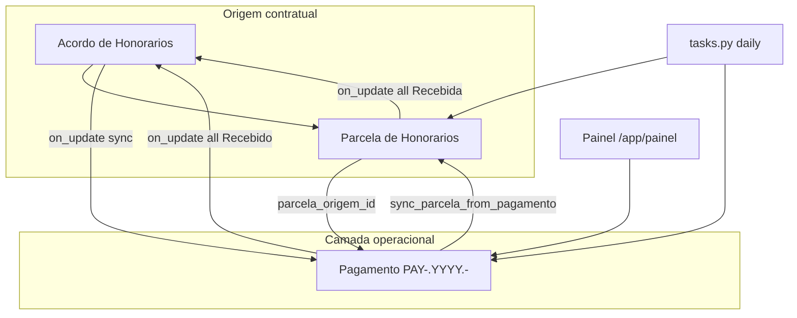

# CODEBASE3.md — App Advocacia (Frappe v16)

**Versão do app:** `0.4.0` (pyproject.toml)  
**Repositório:** https://github.com/ctomazini/advocacia  
**Branch:** `frappe-v16`  
**Bench:** `/home/frappe/frappe-bench` · **Site:** `advocacia.local`  
**Data deste documento:** 2026-05-29  
**Baseline:** `CODEBASE2.md` (estado pós P0–P6)  
**Commits novos:** `98a4138` → `49fc687`

Este documento descreve **tudo implementado após o CODEBASE2**: P6.5 (painel premium), P6.8 (camada financeira `Pagamento`) e o polish operacional subsequente (sidebar, UX financeira, cards de agenda).

---

## 1. Resumo executivo

| Fase | Commit | Foco |
|------|--------|------|
| **P6.5** | `98a4138` | Redesign visual premium do painel; blocos `resumo` e `financeiro` na API |
| **P6.8** | `ad2cb7d` | DocType **Pagamento**; engine `financeiro.py`; sync Acordo→Pagamento; migração idempotente |
| **P6.8+** | `49fc687` | Modo Direto (Valor do Contrato); Pagamento cancelado imutável; cards agenda/prazos/tarefas; sidebar Advocacia; traduções UI |

### Arquitetura financeira (nova)

```text
Acordo de Honorarios Processuais  →  origem contratual (child table intacta)
        │  on_update
        ▼
Parcela de Honorarios  +  parcela_origem_id (UUID estável PARC-{hash12})
        │  sincronizar_pagamentos_do_acordo()
        ▼
Pagamento (PAY-.YYYY.-)  →  camada operacional real (painel, schedulers, list view)
```

**Regra de ouro:** o acordo continua criando parcelamento e exibindo a child table. `Pagamento` é a entidade financeira do dia a dia — sem remover nem substituir o fluxo contratual existente.

---

## 2. Evolução detalhada por fase

### 2.1 P6.5 — Painel premium (`98a4138`)

| Entrega | Detalhe |
|---------|---------|
| `painel.js` | Hero, KPIs 3 colunas, operação do dia, bloco financeiro com gráfico de barras, variáveis CSS Frappe, skeleton loading, responsivo 375px+ |
| `painel_api.py` | Novos blocos `resumo` e `financeiro` no retorno de `get_painel_data` |
| UX | Chips de ação rápida, urgency badge, scroll entre seções |

### 2.2 P6.8 — Camada financeira operacional (`ad2cb7d`)

| Entrega | Arquivo / artefato |
|---------|------------------|
| DocType **Pagamento** | `doctype/pagamento/` — autoname `PAY-.YYYY.-`, links acordo/servico/cliente, status operacionais |
| Campo `parcela_origem_id` | Child table `Parcela de Honorarios` — gerado em `before_insert`, imutável em `validate` |
| Engine sync | `advocacia/advocacia/financeiro.py` — `sincronizar_pagamentos_do_acordo`, regras 1–5 |
| Hooks | `Acordo on_update` → sync; `Pagamento on_update` → Quitado |
| Patch migração | `patches/v16_0/migrar_pagamentos.py` — idempotente, registra em `patches.txt` |
| Painel API | Queries migradas de Parcela → **Pagamento** (operação do dia: vencidos + próximos 7 dias) |
| Schedulers | `verificar_parcelas_vencidas` e `notificar_parcelas_vencidas` operam também em Pagamento |
| List view | `pagamento_list.js` — filtros Vencidos / Próximos 7 dias / Recebidos hoje; indicadores de cor |
| Workspace | Shortcut **Pagamentos** com contador de vencidos |

### 2.3 P6.8+ — Polish operacional (`49fc687`)

| Entrega | Detalhe |
|---------|---------|
| Modo **Honorários Diretos** | Grid de parcelas: coluna editável **Valor do Contrato** (`valor_total`); advogada/cliente/sucumbência ocultos |
| Modo **Acordo com Divisão** | Mantém cálculo via `valor_advogada` + componentes; `valor_total` read-only |
| Pagamento **Cancelado** | Imutável (`validate` + sync ignora); form read-only; botão painel bloqueado |
| Exclusão de parcela | Pagamento órfão pendente → status **Cancelado** (histórico preservado) |
| Painel agenda | Cards `painel-schedule-card` — data em bloco (dia/mês), grid 3 colunas desktop |
| Link financeiro | **Ver pagamentos** → `List / Pagamento` |
| Sidebar Frappe v16 | `workspace_sidebar/Advocacia.json` + `desktop_icon/Advocacia.json` |
| Traduções UI | `setup/translations.py` — `Acordo de Honorarios Processuais` → **Honorários** (pt/pt-BR) |
| Fixes | Removido `frappe.datetime.get_day_name` (inexistente v16); botão **Entrar** estilo outline primário |

---

## 3. Árvore do repositório (delta)

Novos / alterados desde CODEBASE2:

```text
apps/advocacia/
├── CODEBASE3.md                          # este documento
├── advocacia/
│   ├── hooks.py                          # + doc_events Acordo/Pagamento; after_migrate sidebar/translations
│   ├── patches.txt                       # + migrar_pagamentos
│   ├── patches/v16_0/migrar_pagamentos.py
│   ├── desktop_icon/Advocacia.json       # ícone app no desk (Frappe v16)
│   ├── workspace_sidebar/Advocacia.json  # menu lateral prioritizado
│   └── advocacia/
│       ├── financeiro.py                 # NOVO — engine sync Pagamento
│       ├── painel_api.py                 # KPIs/listas em Pagamento
│       ├── tasks.py                      # schedulers + on_pagamento_update
│       ├── setup/
│       │   ├── translations.py           # NOVO
│       │   └── sidebar.py                # NOVO — ensure sidebar idempotente
│       └── doctype/
│           ├── pagamento/                # NOVO DocType
│           │   ├── pagamento.json
│           │   ├── pagamento.py
│           │   ├── pagamento.js          # form read-only se Cancelado
│           │   └── pagamento_list.js
│           ├── parcela_de_honorarios/
│           │   ├── parcela_de_honorarios.json  # + parcela_origem_id
│           │   └── parcela_de_honorarios.py    # before_insert UUID
│           └── acordo_de_honorarios_processuais/
│               └── acordo_*.js           # controlar_grid_parcelas, modo Direto
```

**Total DocTypes:** 17 (16 anteriores + **Pagamento**).

---

## 4. DocType Pagamento

### 4.1 Identificação

| Campo | Valor |
|-------|--------|
| Nome interno | `Pagamento` |
| Module | Advocacia |
| autoname | `PAY-.YYYY.-` (naming series) |
| Rastreio | `parcela_origem_id` (unique, read-only) |

### 4.2 Campos principais

| Grupo | Campos |
|-------|--------|
| Relacionamentos | `acordo`, `servico`, `cliente` (Link, indexados) |
| Origem | `parcela_origem_id`, `sincronizado_em`, `manual_override` |
| Financeiro | `descricao`, `numero_parcela`, `valor`, `valor_recebido` |
| Datas | `data_vencimento`, `data_recebimento` |
| Status | Select: Pendente, Vencido, Recebido, Cancelado, Renegociado, Repassado |
| Controle | `observacoes`, `comprovante` |

### 4.3 Permissões

- **Advocacia User:** read, write, create (sem delete)
- **Advocacia Manager:** acesso total

### 4.4 Regras de negócio (Python)

- `validate`: valor ≥ 0; `parcela_origem_id` único; **Cancelado não pode ser alterado**
- `before_save`: impede criar registro já Cancelado
- Form JS: read-only + intro quando status = Cancelado

---

## 5. Engine de sincronização (`financeiro.py`)

### 5.1 Gatilho

```python
# hooks.py
"Acordo de Honorarios Processuais": {
    "on_update": "advocacia.advocacia.financeiro.sincronizar_pagamentos_hook",
}
```

Flag `frappe.flags.in_pagamento_sync` evita loops e side-effects durante migração/sync em massa.

### 5.2 Regras por parcela

| Caso | Ação |
|------|------|
| Pagamento não existe | **Criar** Pagamento |
| Existe, Pendente/Vencido, sem override, não recebido | **Atualizar** valor, vencimento, descrição, cliente, serviço |
| Já **Recebido/Repassado** | **Não alterar** automaticamente |
| `manual_override = 1` | **Não sobrescrever** |
| **Cancelado** | **Nunca reabrir** nem sincronizar |
| Parcela removida do acordo | Pagamento pendente → **Cancelado**; recebido → **preservado** + log |

### 5.3 Sync reversa (Pagamento → Parcela)

`sync_parcela_from_pagamento(pagamento)` — ao marcar recebido no painel, propaga status para a child row via `parcela_origem_id`.

### 5.4 Migração

```bash
# Executado automaticamente no migrate (post_model_sync)
advocacia.patches.v16_0.migrar_pagamentos

# Reexecutar manualmente (idempotente)
bench --site advocacia.local execute advocacia.advocacia.financeiro.migrar_pagamentos_existentes
```

---

## 6. hooks.py (estado atual)

| Hook | Valor |
|------|--------|
| `scheduler_events.daily` | `tasks.verificar_parcelas_vencidas` (Pagamento + Parcela), `notificar_parcelas_vencidas` (Pagamento), `notificar_audiencias_hoje`, `notificacoes.notificar_prazos_diario` |
| `scheduler_events.weekly` | `tasks.verificar_status_servicos` (considera Pagamento pendente/vencido) |
| `doc_events` | `Acordo` → sync pagamentos; `Parcela` → Quitado; `Pagamento` → Quitado |
| `after_migrate` | `reinstalar_istable_doctypes`, `install.after_install`, `translations.ensure_doctype_translations`, `sidebar.ensure_advocacia_sidebar` |

---

## 7. Painel do escritório (estado atual)

### 7.1 Filosofia: operação do dia

O painel **não** lista a carteira inteira de parcelas. Mostra:

| Seção | Filtro |
|-------|--------|
| Honorários em aberto | Pagamentos **Vencido** + **Pendente** com vencimento ≤ hoje + 7 dias |
| KPIs financeiros | Baseados em **Pagamento** |
| Recebidos hoje | Pagamentos com `data_recebimento = hoje` |

### 7.2 API `get_painel_data` — retorno

```python
{
    "kpis": { ... },           # inclui recebido_hoje, previsto_semana via Pagamento
    "resumo": { ... },         # data_hoje, urgencia, previsto_semana_valor
    "financeiro": { ... },     # gráfico distribuição, taxa inadimplência
    "alertas": [...],
    "parcelas": [...],         # enriquecidos de Pagamento (compat campos valor_total/vencimento)
    "audiencias": [...],
    "prazos": [...],
    "tarefas": [...]
}
```

### 7.3 API `marcar_parcela_recebida(parcela_name)`

- Permissão: **Pagamento** write
- Resolve por nome: **Pagamento** (primário) ou Parcela (fallback legado)
- Pagamento Cancelado → erro
- Define `Recebido`, `data_recebimento`, `valor_recebido`; chama `sync_parcela_from_pagamento`

### 7.4 UI — seções visuais

| Seção | Layout |
|-------|--------|
| Hero + KPIs + financeiro | Premium cards, gráfico barras CSS |
| Honorários em aberto | Cards parcela com botão ✓ Recebida |
| Agenda / Prazos / Tarefas | Grid 3 colunas; cards `painel-schedule-card` com bloco data |
| Botão Entrar (audiência virtual) | Outline primário (compat dark mode) |
| Ver pagamentos | Rota `List / Pagamento` |

---

## 8. Child table Parcela de Honorarios (alterações)

| Campo / lógica | Descrição |
|----------------|-----------|
| `parcela_origem_id` | Data, hidden, read-only; `PARC-{hash12}` em `before_insert` |
| `validate` | Impede alterar ID após criação |
| Modo Direto (JS) | `valor_total` editável como **Valor do Contrato**; demais valores ocultos |
| Modo Divisão (JS) | `valor_total` calculado; editar via advogada/cliente/sucumbência |

---

## 9. Sidebar e navegação (Frappe v16)

### 9.1 Workspace Sidebar `Advocacia`

Arquivo: `advocacia/workspace_sidebar/Advocacia.json`  
Import idempotente via `setup/sidebar.py` no `after_migrate`.

**Ordem de prioridade operacional:**

1. Painel (`/app/painel`)  
2. Serviços  
3. Pagamentos  
4. Honorários  
5. Prazos  
6. Audiências  
7. Tarefas  
8. Registro de Atos  
9. Clientes  
10. Documentos  
11. Cadastros → Comarca, Vara, Tribunal, Fase Processual  

### 9.2 Desktop Icon

`advocacia/desktop_icon/Advocacia.json` — link_type `Workspace Sidebar`, ícone briefcase.

### 9.3 Traduções UI (`setup/translations.py`)

| Source (DocType name) | Exibido na UI |
|-----------------------|---------------|
| Acordo de Honorarios Processuais | **Honorários** |
| Controle de Prazos | **Prazos** |
| Template Documento | **Documentos** |

Nome interno **não muda** — apenas tradução Frappe (pt, pt-BR, pt_BR).

### 9.4 `navegacao.js`

FAB Painel + botão header nos forms: inclui **Pagamento** na lista `DTS`.

---

## 10. Automações atualizadas

### 10.1 Scheduler diário

| Job | Mudança pós-P6.8 |
|-----|------------------|
| `verificar_parcelas_vencidas` | Atualiza **Pagamento** Pendente→Vencido **e** Parcela Pendente→Vencida; sync reversa opcional |
| `notificar_parcelas_vencidas` | Notifica **Pagamento** Vencido (vencimento = hoje−3) |

### 10.2 doc_events — Quitado

Acordo marcado **Quitado** quando:

- Todas parcelas child = Recebida (`on_parcela_update`), **ou**
- Todos Pagamentos do acordo = Recebido/Repassado (`on_pagamento_update`)

Implementação usa `db.set_value` para status (evita revalidar acordos com inconsistência histórica).

### 10.3 Arquivamento semanal de Serviços

`verificar_status_servicos` considera parcelas abertas **ou** pagamentos Pendente/Vencido vinculados ao acordo.

---

## 11. List view Pagamento

Arquivo: `doctype/pagamento/pagamento_list.js`

| Filtro rápido | Critério |
|---------------|----------|
| Vencidos | `status = Vencido` |
| Próximos 7 dias | Pendente + vencimento entre hoje e hoje+7 |
| Recebidos hoje | Recebido/Repassado + data_recebimento = hoje |

Indicadores: vermelho (Vencido), verde (Recebido), laranja (próximo vencimento).

---

## 12. Diagrama financeiro



---

## 13. Comandos úteis (pós-P6.8)

```bash
# Após alterar DocType JSON
bench --site advocacia.local migrate

# Após alterar painel.js / pagamento_list.js
bench --site advocacia.local clear-cache

# Testar sync manual (console)
bench --site advocacia.local console
>>> from advocacia.advocacia.financeiro import sincronizar_pagamentos_do_acordo
>>> import frappe
>>> doc = frappe.get_doc("Acordo de Honorarios Processuais", "ACOR-0001")
>>> sincronizar_pagamentos_do_acordo(doc, commit=True)

# Schedulers
bench --site advocacia.local execute advocacia.advocacia.tasks.verificar_parcelas_vencidas

# Export fixtures antes de commit
bench --site advocacia.local export-fixtures --app advocacia
```

---

## 14. Dívida técnica e pendências

### Resolvido desde CODEBASE2

- Camada financeira operacional com Pagamento independente  
- Painel premium com blocos resumo/financeiro  
- Operação do dia (7 dias) em vez de carteira completa  
- Sidebar Advocacia com atalhos prioritários  
- Tradução **Honorários** site-wide  
- Modo Direto com Valor do Contrato editável  
- Pagamento cancelado imutável (anti-duplicata)  
- Migração idempotente de pagamentos existentes  

### Ainda em aberto (herdado + novo)

1. **Server Scripts:** filtro `status == "Pago"` → usar **Recebida** / **Recebido**.  
2. **Fixtures:** `custom_field` e `server_script` fora de `hooks.fixtures`.  
3. **bench build:** Node 20 vs requisito ≥24 — rebuild assets pode falhar.  
4. **socket.io 404:** worker Socket.IO não configurado — notificações realtime no sino afetadas, painel funciona.  
5. **Fieldnames com acento** (`descrição`, etc.) — migrar em versão futura.  
6. **Envelope API** `{success, data}` — painel ainda retorna dict plano.  
7. **Schedulers duplos:** Parcela + Pagamento coexistem (compatibilidade); consolidar notificações só em Pagamento numa fase futura.  

---

## 15. Commits de referência (pós-CODEBASE2)

| Commit | Mensagem |
|--------|----------|
| `98a4138` | feat: premium visual polish do painel (P6.5) e blocos resumo/financeiro na API |
| `ad2cb7d` | feat: camada financeira operacional com Pagamentos independentes (P6.8) |
| `49fc687` | feat: polish painel operacional, sidebar Advocacia e regras financeiras |

---

## 16. Testes manuais recomendados

1. Criar acordo → salvar → verificar Pagamentos gerados com `parcela_origem_id`.  
2. Modo Direto → adicionar parcela manual → preencher **Valor do Contrato** → salvar.  
3. Excluir parcela pendente → Pagamento correspondente → **Cancelado** (não editável).  
4. Nova parcela após exclusão → **novo** Pagamento (UUID diferente).  
5. Painel → **Ver pagamentos** → List Pagamento.  
6. Audiência virtual → botão **Entrar** legível (outline primário).  
7. Menu lateral → ícone **Advocacia** → atalhos na ordem de prioridade.  
8. UI exibe **Honorários** (não nome longo do DocType).  

---

*Documento gerado para refletir o branch `frappe-v16` após P6.5, P6.8 e polish operacional. Compare com `CODEBASE2.md` para o delta completo desde P0–P6.*
