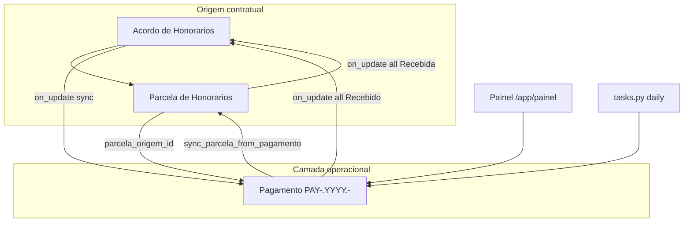
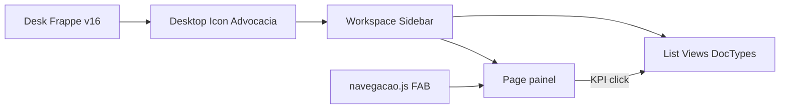

# CODEBASE4.md — App Advocacia (Frappe v16)

**Versão do app:** `0.4.0` (`pyproject.toml`)  
**Repositório:** https://github.com/ctomazini/advocacia  
**Branch:** `frappe-v16`  
**Commit HEAD:** `b96756c`  
**Bench:** `/home/frappe/frappe-bench`  
**Site:** `advocacia.local` (porta 8000)  
**Frappe:** 16.19.0 · **Apps instalados:** `frappe`, `advocacia` (sem ERPNext)  
**Data deste documento:** 2026-05-29  
**Documentos anteriores:** `CODEBASE.md` → `CODEBASE2.md` → `CODEBASE3.md` → **este**

Este é o **inventário completo e atualizado** do app e do site: versionamento desde a auditoria inicial (P0) até o polish de UX/mobile e links de Serviço (`b96756c`).

---

## 1. Resumo executivo

| Dimensão | Estado atual |
|----------|--------------|
| DocTypes principais | 13 + 4 auxiliares + 4 child tables |
| Camada financeira | Acordo/Parcela (contrato) + **Pagamento** (operação) |
| Painel | Page `/app/painel` — KPIs clicáveis, mobile-first, dark mode |
| Navegação | Workspace Sidebar + Desktop Icon + FAB + botão header |
| Automações | Schedulers diários/semanais, sync financeiro, calendários, Notifications |
| Validações BR | CPF, CNPJ, CNJ (Módulo 97), telefone ANATEL, e-mail |
| Roles | `Advocacia User`, `Advocacia Manager` |

### Fases entregues (mapa completo)

| Fase | Commit(s) | Foco |
|------|-----------|------|
| **Auditoria** | `031da43` | Inventário inicial (`CODEBASE.md`) |
| **P0** | `700b222`, `834a2ec` | Limpeza código morto/duplicado |
| **P1** | `9933408` | Roles e permissões |
| **P2** | `0388888` | Validações server-side BR |
| **P3** | `72d9025` | DocTypes auxiliares + Links rígidos |
| **P4** | `a0bc4e0`, `d0bcbf6` | Painel redesign + fix SyntaxError |
| **P5** | `37779d8` | Automações end-to-end |
| **P6** | `753c885` | UX polish (recebida, KPI, dashboard cliente) |
| **P6.5** | `98a4138` | Painel premium + blocos resumo/financeiro |
| **P6.8** | `ad2cb7d` | DocType Pagamento + engine `financeiro.py` |
| **P6.8+** | `49fc687` | Modo Direto, cancelado imutável, sidebar, traduções |
| **P6.9** | `b96756c` | Links Serviço enriquecidos, painel mobile, KPIs filtrados, sidebar fix |

---

## 2. Versionamento Git (cronologia completa)

```text
b96756c  feat: enriquecer links de Serviço e polir painel mobile/UX      ← HEAD
0dab691  docs: adicionar CODEBASE3.md com overview pós P6.5–P6.8
49fc687  feat: polish painel operacional, sidebar Advocacia e regras financeiras
ad2cb7d  feat: camada financeira operacional com Pagamentos independentes (P6.8)
98a4138  feat: premium visual polish do painel (P6.5) e blocos resumo/financeiro na API
70316f8  docs: adicionar CODEBASE2.md com overview atualizado pós P0–P6
753c885  feat: UX polish — marcar recebida no painel, KPI recebido, dashboard cliente (P6)
37779d8  feat: automações end-to-end — scheduler parcelas, calendário, notificações (P5)
d0bcbf6  fix: aspas aninhadas no painel.js causando SyntaxError (P4)
a0bc4e0  feat: painel redesenhado — design system Frappe, responsivo, dark mode (P4)
72d9025  feat: DocTypes auxiliares Comarca/Vara/Tribunal/Fase Processual + migração Link (P3)
0388888  feat: validações server-side CPF/CNPJ/CNJ/telefone + lógica financeira Python (P2)
9933408  feat: roles Advocacia User/Manager + permissões + auth APIs (P1)
700b222  chore: remove arquivos duplicados e código morto (P0)
031da43  docs: auditoria completa do codebase
705f3b1  feat: painel v4 — virtual/presencial, +Audiência/+Prazo/+Tarefa
fedcc35  fix: migração Frappe v16 puro — Cliente, Parcela, Tarefa, documentos.py
5f1b3fa  feat: migração Frappe v16 puro — DocTypes Cliente e Fatura
b4846dc  fix: Link Audiencia Virtual nos fixtures
```

**Remote:** `git@github.com:ctomazini/advocacia.git` · branch `frappe-v16` rastreada em `origin/frappe-v16`.

---

## 3. Ambiente e stack

| Item | Valor |
|------|--------|
| SO | Ubuntu 24.04 (LXC Proxmox) |
| User | `frappe` |
| Python | ≥ 3.10 |
| Node (bench build) | 20.x instalado — **build pode falhar** (Frappe exige ≥24) |
| Dependência app | `docxtpl>=0.18.0` |
| Módulo Frappe | **Advocacia** |
| Convenção imports | `advocacia.advocacia.*` (nunca `advocacia.advocacia.advocacia.*`) |

### Comandos operacionais

```bash
bench --site advocacia.local migrate          # após DocType JSON
bench --site advocacia.local clear-cache      # após JS de Page/DocType
bench build --app advocacia                   # após public/js/ (requer Node ≥24)
bench --site advocacia.local export-fixtures --app advocacia
bench restart                                 # após hooks.py / schedulers
```

---

## 4. Convenção de paths

```text
apps/advocacia/
├── pyproject.toml
├── CODEBASE.md / CODEBASE2.md / CODEBASE3.md / CODEBASE4.md
├── advocacia/
│   ├── hooks.py
│   ├── patches.txt
│   ├── modules.txt
│   ├── fixtures/                    # export Git (workspace, notifications, …)
│   ├── public/js/
│   │   ├── navegacao.js               # FAB Painel + botão header
│   │   └── servico_link.js            # formatter global Link → Serviço
│   ├── workspace_sidebar/
│   │   └── advocacia.json             # ⚠ minúsculas (exigência Frappe v16 sync)
│   ├── desktop_icon/
│   │   └── advocacia.json
│   └── advocacia/                     # pacote Python advocacia.advocacia
│       ├── validators.py
│       ├── financeiro.py
│       ├── tasks.py
│       ├── painel_api.py
│       ├── notificacoes.py
│       ├── documentos.py
│       ├── setup/
│       ├── page/painel/
│       ├── workspace/advocacia/
│       ├── patches/v16_0/
│       └── doctype/
```

---

## 5. Catálogo de DocTypes

### 5.1 Principais (hub operacional)

| DocType | autoname | Hub / função |
|---------|----------|--------------|
| **Cliente** | naming rule | Cadastro PF/PJ; validação CPF/CNPJ |
| **Servico** | `SERV-{####}` | Processo/consultoria — hub central |
| **Acordo de Honorarios Processuais** | — | Contrato de honorários (UI: **Honorários**) |
| **Pagamento** | `PAY-.YYYY.-` | Camada financeira operacional |
| **Registro de Atos** | — | Atos acumulados para cobrança |
| **Audiencia** | — | Agenda; calendário nativo |
| **Controle de Prazos** | — | Prazos processuais; calendário |
| **Tarefa** | — | Tarefas internas |
| **Template Documento** | — | Templates .docx com placeholders |

### 5.2 Auxiliares (cadastro rígido — Link only)

| DocType | Campos-chave |
|---------|--------------|
| **Comarca** | `uf` (Select 27 UFs), `cidade` |
| **Vara** | `comarca` (Link), `tipo` (Select) |
| **Tribunal** | `sigla`, `esfera` (Select) |
| **Fase Processual** | `ordem` (Int) |

### 5.3 Child tables (istable)

| DocType | Pai |
|---------|-----|
| **Parcela de Honorarios** | Acordo de Honorarios Processuais |
| **Ato Advocaticio** | Registro de Atos |
| **Contato Cliente** | Cliente |
| **Endereco Cliente** | Cliente |

### 5.4 Serviço — campos Link obrigatórios

`cliente`, `comarca`, `vara`, `tribunal`, `fase_processual` — nunca texto livre.

### 5.5 Serviço — busca enriquecida (P6.9)

| Config | Valor |
|--------|--------|
| `title_field` | `title` |
| `search_fields` | `title,cliente,numero_processo,status` |
| `show_title_field_in_link` | `1` |
| `standard_queries` | `servico_query` — retorna `título · cliente · CNJ · status` |
| `override get_link_title` | Rótulo legível após seleção |
| `servico_link.js` | Formatter global em forms |

---

## 6. Arquitetura financeira

```text
Acordo de Honorarios Processuais
        │ child table
        ▼
Parcela de Honorarios  (+ parcela_origem_id = PARC-{hash12})
        │ on_update (Acordo) → financeiro.sincronizar_pagamentos_hook
        ▼
Pagamento (PAY-.YYYY.-)  ← painel, schedulers, list view, KPIs
        │ sync_parcela_from_pagamento (reversa)
        ▼
Parcela / Acordo status Quitado
```

### Regras sync (`financeiro.py`)

| Caso | Ação |
|------|------|
| Pagamento inexistente | Criar |
| Pendente/Vencido, sem override | Atualizar valor/vencimento |
| Recebido/Repassado | Não alterar auto |
| `manual_override = 1` | Não sobrescrever |
| **Cancelado** | Imutável — nunca reabrir |
| Parcela removida | Pendente → Cancelado; recebido preservado |

### Modos de honorários (JS Acordo)

| Modo | Comportamento |
|------|---------------|
| **Honorários Diretos** | Coluna **Valor do Contrato** editável na grid |
| **Acordo com Divisão** | Cálculo por advogada/cliente/sucumbência; total read-only |

### Patch migração

```text
advocacia/patches.txt → advocacia.patches.v16_0.migrar_pagamentos
```

Idempotente; reexecutável via `financeiro.migrar_pagamentos_existentes`.

---

## 7. hooks.py (registro central)

```python
# app_include_js
navegacao.js, servico_link.js

# standard_queries
Servico → servico_query

# override_whitelisted_methods
frappe.desk.search.get_link_title → servico.get_link_title

# scheduler_events.daily
tasks.verificar_parcelas_vencidas      # Pagamento + Parcela
tasks.notificar_parcelas_vencidas      # Pagamento
tasks.notificar_audiencias_hoje
notificacoes.notificar_prazos_diario

# scheduler_events.weekly
tasks.verificar_status_servicos        # arquivamento sugerido 90d

# doc_events
Acordo on_update  → financeiro.sincronizar_pagamentos_hook
Parcela on_update → tasks.on_parcela_update (Quitado)
Pagamento on_update → tasks.on_pagamento_update (Quitado)

# after_migrate
reinstalar_istable_doctypes
install.after_install
translations.ensure_doctype_translations
sidebar.ensure_advocacia_sidebar
```

### Fixtures exportados (`hooks.fixtures`)

| DocType | Filtro |
|---------|--------|
| Workspace | `Advocacia` |
| Client Script | `Link Audiencia Virtual` |
| Notification | Prazo vencendo, Audiência amanhã |

---

## 8. APIs whitelisted

| Módulo | Método | Função |
|--------|--------|--------|
| `painel_api` | `get_painel_data` | KPIs, resumo, financeiro, alertas, parcelas, agenda |
| `painel_api` | `marcar_parcela_recebida` | Receber Pagamento (+ sync Parcela) |
| `servico` | `servico_query` | Autocomplete enriquecido |
| `servico` | `get_link_title` | Rótulo legível (override global) |
| `audiencia` | `get_events` | CalendarView |
| `controle_de_prazos` | `get_events` | CalendarView |
| `documentos` | `get_templates_disponiveis` | Lista templates habilitados |
| `documentos` | `gerar_documento` | Gera .docx e anexa ao Serviço |
| `parcela_de_honorarios` | métodos whitelist | Cálculos grid honorários |
| `tarefa` | métodos whitelist | Auxiliares form |

**Permissão painel:** `frappe.has_permission("Servico", "read")`.

---

## 9. Painel do Escritório (`/app/painel`)

### 9.1 Filosofia

Foco em **operação do dia** — não lista carteira inteira. Pagamentos **Vencido** + **Pendente** (vencimento ≤ hoje + 7 dias).

### 9.2 Seções (ordem de renderização)

1. Hero (saudação, data, contexto de urgência, pulse stats)
2. **Ações rápidas** — faixa horizontal scroll (mobile)
3. KPIs clicáveis (6 indicadores)
4. Operação do dia (agenda + parcelas críticas)
5. Financeiro (stats + gráfico barras)
6. Honorários em aberto
7. Grid secundário: Audiências 7d / Prazos / Tarefas

### 9.3 KPIs — rotas ao clicar (P6.9)

| KPI | Destino |
|-----|---------|
| Parcelas vencidas | `List / Pagamento` · status = Vencido |
| Recebido este mês | Pagamento Recebido/Repassado · mês atual |
| Previsto no mês | Pagamento Pendente · vencimento no mês |
| Audiências hoje | `List / Audiencia` · data_hora hoje |
| Prazos urgentes | `List / Controle de Prazos` · Pendente · ≤3 dias |
| Serviços ativos | `List / Servico` · Em andamento |

### 9.4 Ações rápidas — ordem e ícones (P6.9)

| Ordem | Label | Ícone Lucide | DocType |
|-------|-------|--------------|---------|
| 1 | Novo Cliente | `user-plus` | Cliente |
| 2 | Novo Serviço | `folder-plus` | Servico |
| 3 | Nova Audiência | `calendar-plus-2` | Audiencia |
| 4 | Novo Prazo | `clock-plus` | Controle de Prazos |
| 5 | Novo Honorário | `file-plus` | Acordo de Honorarios Processuais |

### 9.5 Mobile (≤768px)

- Hero pulse em grid de cards
- Ações rápidas: scroll horizontal, ícone + label compacto
- KPIs, financeiro, parcelas em coluna única
- FAB Painel **oculto** quando já no painel
- Moeda em texto puro no hero (`format_currency`, sem HTML)

### 9.6 Design system

- Variáveis CSS Frappe (`--card-bg`, `--primary`, `--text-muted`, …)
- Sem hex hardcoded; dark mode automático
- Skeleton loading; animação fade-in
- Breakpoints: 1024px, 768px, 640px

---

## 10. Navegação e sidebar

### 10.1 Workspace Sidebar (`workspace_sidebar/advocacia.json`)

Import idempotente via `setup/sidebar.py` no `after_migrate`.

**⚠ Importante:** arquivos devem ser **minúsculos** (`advocacia.json`). Nomes com maiúsculas (`Advocacia.json`) são apagados como órfãos no migrate.

**Ordem operacional:**

1. Painel (Page `painel`)
2. Serviços
3. Pagamentos
4. Honorários
5. Prazos
6. Audiências
7. Tarefas
8. Registro de Atos
9. Clientes
10. Documentos
11. Cadastros → Comarca, Vara, Tribunal, Fase Processual

### 10.2 Desktop Icon

`desktop_icon/advocacia.json` — ícone briefcase → Workspace Sidebar Advocacia.

### 10.3 Workspace clássico

`workspace/advocacia/advocacia.json` — shortcuts + links; Painel como Page.

### 10.4 `navegacao.js`

- FAB fixo "← Painel" nos forms/listas do escopo jurídico
- Botão **Painel** no header do form
- Escopo: Servico, Pagamento, Prazos, Audiencia, Registro de Atos, Acordo, Tarefa, Cliente, Template Documento

### 10.5 Traduções UI (`setup/translations.py`)

| DocType (name) | UI |
|----------------|-----|
| Acordo de Honorarios Processuais | Honorários |
| Controle de Prazos | Prazos |
| Template Documento | Documentos |

---

## 11. Automações

### 11.1 Schedulers

| Job | Periodicidade | Efeito |
|-----|---------------|--------|
| `verificar_parcelas_vencidas` | daily | Pagamento/Parcela Pendente → Vencido/Vencida |
| `notificar_parcelas_vencidas` | daily | Notifica Pagamento vencido (D+3) |
| `notificar_audiencias_hoje` | daily | Audiências do dia |
| `notificar_prazos_diario` | daily | Prazos conforme `dias_notificacao` |
| `verificar_status_servicos` | weekly | Sugere arquivamento sem atividade 90d |

### 11.2 doc_events — cascata Quitado

Acordo → **Quitado** quando todas parcelas = Recebida **ou** todos Pagamentos = Recebido/Repassado.

### 11.3 Calendários

| DocType | Campo datetime/date | JS |
|---------|---------------------|-----|
| Audiencia | `data_hora` | `audiencia_calendar.js` |
| Controle de Prazos | `data_prazo` | `controle_de_prazos_calendar.js` |

### 11.4 Notifications (fixtures)

- Advocacia - Prazo vencendo
- Advocacia - Audiencia amanha

---

## 12. Validações (`validators.py`)

| Função | Regra |
|--------|--------|
| `validar_cpf` | Dígitos verificadores RF; rejeita sequências |
| `validar_cnpj` | Dígitos verificadores RF |
| `validar_cnj` | 20 dígitos; Módulo 97 Base 10 (Res. 65/2008) |
| `validar_telefone` | DDD ANATEL; celular 11 dígitos (9º=9) |
| `limpar_numerico` | Armazena IDs só com dígitos |
| E-mail | `.lower()` antes de salvar |

**Cronologia teórica (Serviço):** Data Fato ≤ Distribuição ≤ Intimação < Prazo Fatal.

---

## 13. Documentos (.docx)

`documentos.py` + `docxtpl`:

1. Usuário clica **Gerar Documento** no form Serviço
2. Seleciona Template Documento habilitado
3. API gera arquivo → anexa ao Serviço → download

---

## 14. List views customizadas

| DocType | Arquivo | Filtros rápidos |
|---------|---------|-----------------|
| Pagamento | `pagamento_list.js` | Vencidos, Próximos 7d, Recebidos hoje |

Indicadores coloridos por status (vermelho/verde/laranja/cinza).

---

## 15. Diagramas

### 15.1 Fluxo financeiro



### 15.2 Navegação do site



---

## 16. Delta P6.9 (`b96756c`) — desde CODEBASE3

| Entrega | Detalhe |
|---------|---------|
| **Serviço link** | `title_field`, `search_fields`, `servico_query`, `get_link_title`, `servico_link.js` |
| **Hero moeda** | `format_currency()` em texto puro — corrige `<div>` exposto |
| **KPIs clicáveis** | Rotas filtradas para Pagamento/Audiencia/Prazos/Servico |
| **Mobile painel** | Scroll ações, pulse em cards, coluna única, padding safe-area |
| **Sidebar fix** | Rename `Advocacia.json` → `advocacia.json`; Painel `link_type: Page` |
| **FAB** | Oculto no painel; posição safe-area mobile |

---

## 17. Dívida técnica

| # | Item | Prioridade |
|---|------|------------|
| 1 | Server Scripts com status `"Pago"` → usar Recebida/Recebido | Alta |
| 2 | `custom_field` / `server_script` fora de `hooks.fixtures` | Média |
| 3 | `bench build` — Node 20 vs requisito ≥24 | Média |
| 4 | socket.io 404 — notificações realtime no sino | Baixa |
| 5 | Fieldnames com acento (`descrição`) — migrar | Baixa |
| 6 | Envelope API `{success, data}` no painel | Baixa |
| 7 | Schedulers duplos Parcela + Pagamento (compat.) | Baixa |
| 8 | Bump versão `pyproject.toml` para 0.5.0 pós-P6.9 | Cosmética |

---

## 18. Testes manuais recomendados

1. **Serviço link:** criar Audiência → buscar Serviço → ver título · cliente · status.
2. **Painel hero:** urgência alta → moeda sem HTML visível.
3. **KPIs:** clicar cada indicador → lista filtrada correta.
4. **Mobile 375px:** faixa ações scroll; pulse em cards; sem FAB duplicado.
5. **Sidebar:** ícone Advocacia → Painel primeiro item; sobrevive `bench migrate`.
6. **Financeiro:** acordo → pagamentos sync; excluir parcela → cancelado imutável.
7. **Modo Direto:** Valor do Contrato editável na grid.
8. **Calendário:** Audiencia e Prazos renderizam eventos.
9. **Schedulers:** `bench --site advocacia.local execute advocacia.advocacia.tasks.verificar_parcelas_vencidas`.

---

## 19. Commits de referência por documento

| Documento | Cobertura commits |
|-------------|-------------------|
| `CODEBASE.md` | Pré-P0 (auditoria) |
| `CODEBASE2.md` | P0–P6 (`753c885`) |
| `CODEBASE3.md` | P6.5–P6.8+ (`49fc687`) |
| **`CODEBASE4.md`** | **P0–P6.9 completo (`b96756c`)** |

---

*Documento gerado para refletir o branch `frappe-v16` no commit `b96756c`. Para delta incremental, compare com `CODEBASE3.md` (P6.8+) ou `CODEBASE2.md` (P0–P6).*
