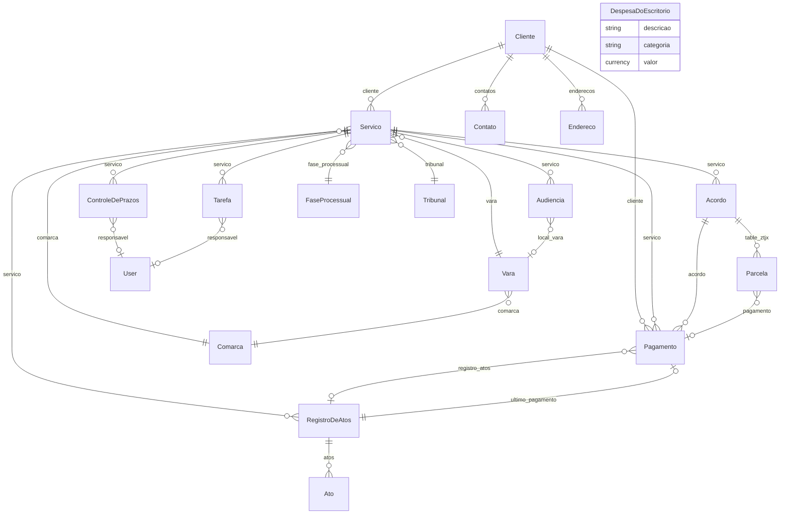

# CODEBASE5.md — App Advocacia

**Auditoria técnica para deploy**  
**Repositório:** `git@github.com:ctomazini/advocacia.git` · branch `frappe-v16`  
**Versão:** `0.5.0`  
**Data:** 2026-05-31  
**Escopo:** todos os arquivos `.py`, `.js`, `.json`, `.html`, `.md` em `/home/frappe/frappe-bench/apps/advocacia/`

> **Nota sobre o prompt de auditoria:** o ambiente real **não** usa Docker nem ERPNext. O site de desenvolvimento roda **Frappe v16.19.0 nativo** (bench LXC). Apps instalados no site `advocacia.local`: `frappe`, `advocacia` apenas.

---

## Sumário

1. [Visão Geral](#1-visão-geral)
2. [Árvore de DocTypes](#2-árvore-de-doctypes)
3. [Mapa de Relacionamentos](#3-mapa-de-relacionamentos)
4. [Server Scripts & Hooks](#4-server-scripts--hooks)
5. [Client Scripts & Frontend](#5-client-scripts--frontend)
6. [Fixtures](#6-fixtures)
7. [Templates e Geração de Documentos](#7-templates-e-geração-de-documentos)
8. [Scheduler Jobs](#8-scheduler-jobs)
9. [Análise de Integridade (Checklist de Deploy)](#9-análise-de-integridade-checklist-de-deploy)
10. [Gaps e Recomendações](#10-gaps-e-recomendações)

---

## 1. Visão Geral

| Atributo | Valor |
|----------|-------|
| **App name** | `advocacia` |
| **Versão** | `0.5.0` (`pyproject.toml` e `advocacia/__init__.py`) |
| **Framework** | Frappe **v16.19.0** (não v15) |
| **ERPNext** | **Não instalado** no site `advocacia.local` |
| **Propósito** | Módulo jurídico para escritório de advocacia solo: clientes, serviços/processos, honorários, pagamentos, despesas operacionais, prazos, audiências, atos, painel operacional |
| **Stack** | Ubuntu 24.04 LXC · Bench nativo `/home/frappe/frappe-bench` · MariaDB · Redis · **sem Docker** |
| **Dependência Python** | `docxtpl>=0.18.0` |
| **Site atendido** | `advocacia.local` (porta 8000) — **single-tenant**; não há lógica multi-site no código |
| **Roles do app** | `Advocacia User`, `Advocacia Manager` (criadas em `after_install`) — **não existe** role "Advogado" |
| **Módulo Frappe** | `Advocacia` (`modules.txt`) |

### Estrutura de diretórios relevante

```
advocacia/                          # raiz Git
├── pyproject.toml
├── codebase.md                     # este arquivo
├── advocacia/                      # pacote Frappe (hooks.py)
│   ├── hooks.py
│   ├── patches.txt
│   ├── fixtures/                   # fixtures exportadas (hooks)
│   ├── workspace_sidebar/
│   ├── desktop_icon/
│   ├── patches/v16_0/
│   └── advocacia/                  # módulo Advocacia
│       ├── doctype/                # 18 DocTypes
│       ├── page/painel/
│       ├── report/                 # 4 Query Reports
│       ├── financeiro.py
│       ├── painel_api.py
│       ├── documentos.py
│       ├── tasks.py
│       ├── notificacoes.py
│       ├── validators.py
│       └── setup/
└── public/js/                      # assets globais (build)
```

---

## 2. Árvore de DocTypes

**Localização:** `advocacia/advocacia/doctype/`  
**Total:** 18 DocTypes (14 standalone + 4 child tables `istable=1`)  
**Todos:** `module = Advocacia`, `custom = 0`

### Relações parent → child (Table)

| Parent | fieldname | Child |
|--------|-----------|-------|
| Cliente | `contatos` | Contato Cliente |
| Cliente | `enderecos` | Endereco Cliente |
| Acordo de Honorarios Processuais | `table_ztjx` | Parcela de Honorarios |
| Registro de Atos | `atos` | Ato Advocaticio |

---

### 2.1 Servico *(hub central)*

| Meta | Valor |
|------|-------|
| is_submittable / is_tree / issingle | 0 / 0 / 0 |
| title_field | `title` |
| search_fields | `title,cliente,numero_processo,status` |
| sort_field / order | `modified` / DESC |
| autoname | `format:SERV-{####}` |

**Permissões:** Advocacia Manager (CRUD), Advocacia User (sem delete), System Manager (CRUD)

| fieldname | fieldtype | options | reqd | read_only | hidden | depends_on | fetch_from |
|-----------|-----------|---------|------|-----------|--------|------------|------------|
| informacoes_section | Section Break | | 0 | 0 | 0 | | |
| cliente | Link | Cliente | 1 | 0 | 0 | | |
| tipo | Select | Processo Judicial, Consultoria, Contrato, Diligência, Administrativo | 1 | 0 | 0 | | |
| title | Data | | 0 | 0 | 0 | | |
| column_break_info | Column Break | | 0 | 0 | 0 | | |
| status | Select | Em andamento, Encerrado, Suspenso, Arquivado | 0 | 0 | 0 | | |
| fase_processual | Link | Fase Processual | 0 | 0 | 0 | | |
| data_abertura | Date | | 0 | 0 | 0 | | |
| processo_section | Section Break | | 0 | 0 | 0 | eval:doc.tipo=="Processo Judicial" | |
| numero_processo | Data | | 0 | 0 | 0 | eval:doc.tipo=="Processo Judicial" | |
| numeracao_legada | Check | | 0 | 0 | 0 | eval:doc.tipo=="Processo Judicial" | |
| area | Select | Família, Trabalhista, Cível, Criminal, Previdenciário, Administrativo, Tributário | 0 | 0 | 0 | | |
| column_break_proc | Column Break | | 0 | 0 | 0 | | |
| vara | Link | Vara | 0 | 0 | 0 | | |
| tribunal | Link | Tribunal | 0 | 0 | 0 | | |
| comarca | Link | Comarca | 0 | 0 | 0 | | |
| column_break_proc2 | Column Break | | 0 | 0 | 0 | | |
| parte_contraria | Data | | 0 | 0 | 0 | | |
| valor_causa | Currency | | 0 | 0 | 0 | | |
| observacoes_section | Section Break | | 0 | 0 | 0 | | |
| observacoes | Text Editor | | 0 | 0 | 0 | | |

**Python:** `servico.py` — validação CNJ, `servico_query`, override `get_link_title`

---

### 2.2 Cliente

| Meta | Valor |
|------|-------|
| title_field | `nome` |
| search_fields | `nome,cpf,cnpj` |
| autoname | `field:nome` |

| fieldname | fieldtype | options | reqd | read_only | hidden | depends_on | fetch_from |
|-----------|-----------|---------|------|-----------|--------|------------|------------|
| tipo_pessoa | Select | Pessoa Física, Pessoa Jurídica | 1 | 0 | 0 | | |
| nome | Data | | 1 | 0 | 0 | | |
| nome_fantasia | Data | | 0 | 0 | 0 | eval:doc.tipo_pessoa=='Pessoa Jurídica' | |
| col_break_1 | Column Break | | 0 | 0 | 0 | | |
| cpf | Data | | 0 | 0 | 0 | eval:doc.tipo_pessoa=='Pessoa Física' | |
| rg | Data | | 0 | 0 | 0 | eval:doc.tipo_pessoa=='Pessoa Física' | |
| cnpj | Data | | 0 | 0 | 0 | eval:doc.tipo_pessoa=='Pessoa Jurídica' | |
| sec_pf | Section Break | | 0 | 0 | 0 | eval:doc.tipo_pessoa=='Pessoa Física' | |
| nacionalidade | Data | | 0 | 0 | 0 | | |
| estado_civil | Select | Solteiro(a), Casado(a), Divorciado(a), Viúvo(a), União Estável | 0 | 0 | 0 | | |
| profissao | Data | | 0 | 0 | 0 | | |
| sec_pj | Section Break | | 0 | 0 | 0 | eval:doc.tipo_pessoa=='Pessoa Jurídica' | |
| representante | Data | | 0 | 0 | 0 | | |
| cpf_representante | Data | | 0 | 0 | 0 | | |
| col_break_pj | Column Break | | 0 | 0 | 0 | | |
| cargo_representante | Data | | 0 | 0 | 0 | | |
| nacionalidade_pj | Data | | 0 | 0 | 0 | | |
| sec_contatos | Section Break | | 0 | 0 | 0 | | |
| contatos | Table | Contato Cliente | 0 | 0 | 0 | | |
| sec_enderecos | Section Break | | 0 | 0 | 0 | | |
| enderecos | Table | Endereco Cliente | 0 | 0 | 0 | | |
| sec_obs | Section Break | | 0 | 0 | 0 | | |
| observacoes | Text Editor | | 0 | 0 | 0 | | |

**Python:** CPF/CNPJ/telefone/email via `validators.py`

---

### 2.3 Acordo de Honorarios Processuais

| Meta | Valor |
|------|-------|
| title_field | `servico` |
| search_fields | *(null)* |
| autoname | `format:ACOR-{####}` |

| fieldname | fieldtype | options | reqd | read_only | hidden | depends_on | fetch_from |
|-----------|-----------|---------|------|-----------|--------|------------|------------|
| vinculação_section | Section Break | | 0 | 0 | 0 | | |
| servico | Link | Servico | 1 | 0 | 0 | | |
| cliente | Link | Cliente | 1 | 1 | 0 | | servico.cliente |
| modo_honorarios | Select | Honorários Diretos, Acordo com Divisão | 1 | 0 | 0 | | |
| column_break_vinc | Column Break | | 0 | 0 | 0 | | |
| status | Select | Vigente, Encerrado, Cancelado, Quitado | 0 | 0 | 0 | | |
| valores_do_acordo_section | Section Break | | 0 | 0 | 0 | | |
| valor_total_do_acordo | Currency | | 0 | 0 | 0 | | |
| percentual_advogada | Percent | | 0 | 0 | 0 | | |
| valor_fixo_de_honorarios | Currency | | 0 | 0 | 0 | | |
| valor_advogada | Currency | | 0 | 1 | 0 | | |
| column_break_val | Column Break | | 0 | 0 | 0 | | |
| tipo_de_cobrança | Select | Valor fixo, Percentual do acordo, Percentual da causa, Misto | 1 | 0 | 0 | | |
| percentual_cliente | Percent | | 0 | 1 | 0 | eval:doc.modo_honorarios=='Acordo com Divisão' | |
| valor_cliente | Currency | | 0 | 1 | 0 | eval:doc.modo_honorarios=='Acordo com Divisão' | |
| sucumbência_section | Section Break | | 0 | 0 | 0 | eval:doc.modo_honorarios=='Acordo com Divisão' | |
| tipo_de_cálculo | Select | Percentual, Valor fixo | 0 | 0 | 0 | eval:doc.modo_honorarios=='Acordo com Divisão' | |
| percentual_sucumbência | Percent | | 0 | 0 | 0 | eval:doc.modo_honorarios=='Acordo com Divisão' | |
| column_break_suc | Column Break | | 0 | 0 | 0 | eval:doc.modo_honorarios=='Acordo com Divisão' | |
| honorários_de_sucumbência | Currency | | 0 | 0 | 0 | eval:doc.modo_honorarios=='Acordo com Divisão' | |
| status_da_sucumbência | Select | A definir, Deferida, Indeferida, Paga | 0 | 0 | 0 | eval:doc.modo_honorarios=='Acordo com Divisão' | |
| parcelamento_section | Section Break | | 0 | 0 | 0 | | |
| número_de_parcelas | Int | | 0 | 0 | 0 | | |
| data_primeira_parcela | Date | | 0 | 0 | 0 | | |
| column_break_parc | Column Break | | 0 | 0 | 0 | | |
| valor_da_parcela | Currency | | 0 | 1 | 0 | | |
| gerar_parcelas | Button | | 0 | 0 | 0 | | |
| parcelas_section | Section Break | | 0 | 0 | 0 | | |
| table_ztjx | Table | Parcela de Honorarios | 0 | 0 | 0 | | |
| totais_section | Section Break | | 0 | 0 | 0 | | |
| total_advogada | Currency | | 0 | 1 | 0 | | |
| column_break_tot | Column Break | | 0 | 0 | 0 | | |
| total_cliente | Currency | | 0 | 1 | 0 | | |
| observações_section | Section Break | | 0 | 0 | 0 | | |
| observações | Text Editor | | 0 | 0 | 0 | | |

**Python:** validação financeira completa em `acordo_de_honorarios_processuais.py`

---

### 2.4 Parcela de Honorarios *(child, istable=1)*

| Meta | Valor |
|------|-------|
| permissions | `[]` (herda do parent) |
| autoname | null |

| fieldname | fieldtype | options | reqd | read_only | hidden | depends_on | fetch_from |
|-----------|-----------|---------|------|-----------|--------|------------|------------|
| vencimento | Date | | 1 | 0 | 0 | | |
| valor_total | Currency | | 0 | 1 | 0 | | |
| valor_advogada | Currency | | 0 | 0 | 0 | | |
| valor_sucumbência | Currency | | 0 | 0 | 0 | | |
| valor_cliente | Currency | | 0 | 0 | 0 | | |
| descrição | Small Text | | 0 | 0 | 0 | | |
| parcela_origem_id | Data | | 0 | 1 | 1 | | |
| pagamento | Link | Pagamento | 0 | 1 | 0 | | |
| status | Select | Pendente, Vencida, Recebida, Repassada, Cancelada | 0 | 0 | 0 | | |
| data_recebimento | Date | | 0 | 0 | 0 | | |
| data_repasse | Date | | 0 | 0 | 0 | eval:doc.valor_cliente > 0 | |
| forma_recebimento | Select | PIX, TED, Dinheiro, Cartão, Boleto | 0 | 0 | 0 | | |
| observacao | Small Text | | 0 | 0 | 0 | | |

---

### 2.5 Pagamento

| Meta | Valor |
|------|-------|
| title_field / search_fields | *(null)* |
| sort_field / order | `data_vencimento` / ASC |
| autoname | `naming_series:` → `PAY-.YYYY.-` |

| fieldname | fieldtype | options | reqd | read_only | hidden | depends_on | fetch_from |
|-----------|-----------|---------|------|-----------|--------|------------|------------|
| naming_series | Select | PAY-.YYYY.- | 0 | 0 | 0 | | |
| sec_relacionamentos | Section Break | | 0 | 0 | 0 | | |
| tipo_origem | Select | Honorários (Parcela), Atos Advocatícios | 0 | 0 | 0 | | |
| acordo | Link | Acordo de Honorarios Processuais | 0 | 0 | 0 | | |
| registro_atos | Link | Registro de Atos | 0 | 1 | 0 | eval:doc.tipo_origem=='Atos Advocatícios' | |
| servico | Link | Servico | 1 | 0 | 0 | | |
| cliente | Link | Cliente | 1 | 0 | 0 | | |
| col_rel_1 | Column Break | | 0 | 0 | 0 | | |
| numero_parcela | Int | | 0 | 0 | 0 | | |
| descricao | Data | | 0 | 0 | 0 | | |
| sec_origem | Section Break | | 0 | 0 | 0 | | |
| parcela_origem_id | Data | | 0 | 1 | 0 | | |
| sincronizado_em | Datetime | | 0 | 1 | 0 | | |
| manual_override | Check | | 0 | 0 | 0 | eval:doc.tipo_origem=='Honorários (Parcela)' | |
| sec_financeiro | Section Break | | 0 | 0 | 0 | | |
| valor | Currency | | 1 | 0 | 0 | | |
| valor_recebido | Currency | | 0 | 0 | 0 | | |
| col_fin_1 | Column Break | | 0 | 0 | 0 | | |
| data_vencimento | Date | | 1 | 0 | 0 | | |
| data_recebimento | Date | | 0 | 0 | 0 | | |
| status | Select | Pendente, Vencido, Recebido, Cancelado, Renegociado, Repassado | 1 | 0 | 0 | | |
| sec_controle | Section Break | | 0 | 0 | 0 | | |
| observacoes | Small Text | | 0 | 0 | 0 | | |
| comprovante | Attach | | 0 | 0 | 0 | | |

**Python:** `pagamento.py` — validação por `tipo_origem`, imutabilidade de cancelados

---

### 2.6 Registro de Atos

| Meta | Valor |
|------|-------|
| title_field / search_fields | *(null)* |
| autoname | `format:ATOS-{####}` |

| fieldname | fieldtype | options | reqd | read_only | hidden | depends_on | fetch_from |
|-----------|-----------|---------|------|-----------|--------|------------|------------|
| informacoes_section | Section Break | | 0 | 0 | 0 | | |
| servico | Link | Servico | 1 | 0 | 0 | | |
| cliente | Link | Cliente | 1 | 1 | 0 | | servico.cliente |
| column_break_info | Column Break | | 0 | 0 | 0 | | |
| status | Select | Em aberto, Parcialmente cobrado, Cobrado | 0 | 0 | 0 | | |
| data_abertura | Date | | 0 | 0 | 0 | | |
| atos_section | Section Break | | 0 | 0 | 0 | | |
| atos | Table | Ato Advocaticio | 0 | 0 | 0 | | |
| totais_section | Section Break | | 0 | 0 | 0 | | |
| total_pendente | Currency | | 0 | 1 | 0 | | |
| column_break_tot | Column Break | | 0 | 0 | 0 | | |
| total_cobrado | Currency | | 0 | 1 | 0 | | |
| column_break_tot2 | Column Break | | 0 | 0 | 0 | | |
| total_geral | Currency | | 0 | 1 | 0 | | |
| cobranca_section | Section Break | | 0 | 0 | 0 | | |
| data_vencimento_cobranca | Date | | 0 | 0 | 0 | | |
| ultimo_pagamento | Link | Pagamento | 0 | 1 | 0 | | |
| gerar_cobranca | Button | | 0 | 0 | 0 | | |
| observacoes_section | Section Break | | 0 | 0 | 0 | | |
| observacoes | Text Editor | | 0 | 0 | 0 | | |

---

### 2.7 Ato Advocaticio *(child, istable=1)*

| fieldname | fieldtype | options | reqd | read_only | hidden | depends_on | fetch_from |
|-----------|-----------|---------|------|-----------|--------|------------|------------|
| data | Date | | 1 | 0 | 0 | | |
| tipo | Select | Inicial, Audiência, Defesa, Diligência, Consulta, Contrato, Administrativo, Outro | 1 | 0 | 0 | | |
| descrição | Small Text | | 0 | 0 | 0 | | |
| valor | Currency | | 1 | 0 | 0 | | |
| status | Select | Pendente, Cobrado | 0 | 0 | 0 | | |
| cobranca_id | Data | | 0 | 1 | 0 | | |

---

### 2.8 Controle de Prazos

| Meta | Valor |
|------|-------|
| title_field / search_fields | *(null)* |
| autoname | `format:PRAZO-{####}` |

| fieldname | fieldtype | options | reqd | read_only | hidden | depends_on | fetch_from |
|-----------|-----------|---------|------|-----------|--------|------------|------------|
| informacoes_section | Section Break | | 0 | 0 | 0 | | |
| servico | Link | Servico | 1 | 0 | 0 | | |
| cliente | Link | Cliente | 1 | 1 | 0 | | servico.cliente |
| column_break_info | Column Break | | 0 | 0 | 0 | | |
| data_prazo | Date | | 1 | 0 | 0 | | |
| status | Select | Pendente, Concluído, Vencido | 0 | 0 | 0 | | |
| detalhes_section | Section Break | | 0 | 0 | 0 | | |
| descricao | Small Text | | 1 | 0 | 0 | | |
| prioridade | Select | Alta, Média, Baixa | 0 | 0 | 0 | | |
| column_break_det | Column Break | | 0 | 0 | 0 | | |
| responsavel | Link | User | 0 | 0 | 0 | | |
| dias_notificacao | Int | | 0 | 0 | 0 | | |
| observacoes_section | Section Break | | 0 | 0 | 0 | | |
| observacoes | Text Editor | | 0 | 0 | 0 | | |

**Python:** stub Document + `get_events` para calendário

---

### 2.9 Audiencia

| Meta | Valor |
|------|-------|
| title_field / search_fields | *(null)* |
| autoname | `format:AUD-{####}` |

| fieldname | fieldtype | options | reqd | read_only | hidden | depends_on | fetch_from |
|-----------|-----------|---------|------|-----------|--------|------------|------------|
| informacoes_section | Section Break | | 0 | 0 | 0 | | |
| servico | Link | Servico | 1 | 0 | 0 | | |
| cliente | Link | Cliente | 1 | 1 | 0 | | servico.cliente |
| column_break_info | Column Break | | 0 | 0 | 0 | | |
| data_hora | Datetime | | 1 | 0 | 0 | | |
| status_aud | Select | Agendada, Realizada, Adiada, Cancelada | 0 | 0 | 0 | | |
| detalhes_section | Section Break | | 0 | 0 | 0 | | |
| tipo | Select | Conciliação, Instrução, Julgamento, Una | 1 | 0 | 0 | | |
| modalidade | Select | Presencial, Virtual | 0 | 0 | 0 | | |
| link_virtual | Data | URL | 0 | 0 | 0 | eval:doc.modalidade=='Virtual' | |
| column_break_det | Column Break | | 0 | 0 | 0 | | |
| local_vara | Link | Vara | 0 | 0 | 0 | | |
| resultado | Select | Realizada, Adiada, Acordo, Sem acordo | 0 | 0 | 0 | | |
| observacoes_section | Section Break | | 0 | 0 | 0 | | |
| observacoes | Text Editor | | 0 | 0 | 0 | | |

---

### 2.10 Tarefa

| Meta | Valor |
|------|-------|
| title_field | `titulo` |
| search_fields | `titulo,status,responsavel` |
| autoname | `naming_series:` → `TAR-.YYYY.-` |

| fieldname | fieldtype | options | reqd | read_only | hidden | depends_on | fetch_from |
|-----------|-----------|---------|------|-----------|--------|------------|------------|
| naming_series | Select | TAR-.YYYY.- | 0 | 0 | 0 | | |
| titulo | Data | | 1 | 0 | 0 | | |
| status | Select | Pendente, Em Andamento, Concluída, Cancelada | 0 | 0 | 0 | | |
| col_break_1 | Column Break | | 0 | 0 | 0 | | |
| prioridade | Select | Normal, Alta, Urgente | 0 | 0 | 0 | | |
| data_limite | Date | | 0 | 0 | 0 | | |
| sec_detalhes | Section Break | | 0 | 0 | 0 | | |
| descricao | Text Editor | | 0 | 0 | 0 | | |
| servico | Link | Servico | 0 | 0 | 0 | | |
| col_break_2 | Column Break | | 0 | 0 | 0 | | |
| responsavel | Link | User | 0 | 0 | 0 | | |
| data_conclusao | Date | | 0 | 0 | 0 | | |

---

### 2.11 Template Documento

| Meta | Valor |
|------|-------|
| title_field | `titulo` |
| search_fields | `titulo,tipo_documento` |
| autoname | `field:titulo` |

| fieldname | fieldtype | options | reqd | read_only | hidden | depends_on | fetch_from |
|-----------|-----------|---------|------|-----------|--------|------------|------------|
| titulo | Data | | 1 | 0 | 0 | | |
| tipo_documento | Select | Contrato, Declaracao, Recibo, Carta, Ficha de Atendimento, Outro | 1 | 0 | 0 | | |
| descricao | Small Text | | 0 | 0 | 0 | | |
| column_break_1 | Column Break | | 0 | 0 | 0 | | |
| habilitado | Check | | 0 | 0 | 0 | | |
| arquivo | Attach | | 1 | 0 | 0 | | |
| section_break_2 | Section Break | | 0 | 0 | 0 | | |
| ver_placeholders | Button | | 0 | 0 | 0 | | |

---

### 2.12 Comarca *(auxiliar)*

| Meta | Valor |
|------|-------|
| title_field | `comarca_name` |
| search_fields | `comarca_name,city,uf` |
| autoname | `field:comarca_name` |

| fieldname | fieldtype | options | reqd |
|-----------|-----------|---------|------|
| comarca_name | Data | | 1 |
| uf | Select | 27 UFs | 1 |
| city | Data | | 0 |

---

### 2.13 Vara *(auxiliar)*

| Meta | Valor |
|------|-------|
| title_field | `vara_name` |
| search_fields | `vara_name,comarca,court_type` |
| autoname | `field:vara_name` |

| fieldname | fieldtype | options | reqd |
|-----------|-----------|---------|------|
| vara_name | Data | | 1 |
| comarca | Link | Comarca | 1 |
| court_type | Select | Cível, Criminal, Família, Trabalho, Federal, Juizado Especial, Fazenda Pública | 0 |

---

### 2.14 Tribunal *(auxiliar)*

| Meta | Valor |
|------|-------|
| title_field | `tribunal_name` |
| search_fields | `tribunal_name,abbreviation,jurisdiction` |
| autoname | `field:tribunal_name` |

| fieldname | fieldtype | options | reqd |
|-----------|-----------|---------|------|
| tribunal_name | Data | | 1 |
| abbreviation | Data | | 1 |
| jurisdiction | Select | Estadual, Federal, Trabalho, Superior, Militar, Eleitoral | 1 |

---

### 2.15 Fase Processual *(auxiliar)*

| Meta | Valor |
|------|-------|
| title_field | `phase_name` |
| search_fields | `phase_name` |
| sort_field | `sort_order` ASC |
| autoname | `field:phase_name` |

| fieldname | fieldtype | options | reqd |
|-----------|-----------|---------|------|
| phase_name | Data | | 1 |
| sort_order | Int | | 0 |

---

### 2.16 Contato Cliente *(child, istable=1)*

| fieldname | fieldtype | options | reqd |
|-----------|-----------|---------|------|
| nome | Data | | 1 |
| tipo | Select | Principal, Conjuge, Responsável, Outro | 0 |
| telefone | Data | | 0 |
| celular | Data | | 0 |
| email | Data | Email | 0 |
| observacao | Small Text | | 0 |

---

### 2.17 Endereco Cliente *(child, istable=1)*

| fieldname | fieldtype | options | reqd |
|-----------|-----------|---------|------|
| tipo | Select | Residencial, Comercial, Correspondência, Outro | 0 |
| cep | Data | | 0 |
| logradouro | Data | | 1 |
| numero | Data | | 0 |
| complemento | Data | | 0 |
| bairro | Data | | 0 |
| cidade | Data | | 0 |
| estado | Select | 27 UFs | 0 |
| principal | Check | | 0 |

---

### 2.18 Despesa do Escritorio *(standalone — overhead operacional)*

| Meta | Valor |
|------|-------|
| is_submittable / is_tree / issingle | 0 / 0 / 0 |
| title_field | `descricao` |
| search_fields | `descricao,categoria,status,data_vencimento` |
| sort_field / order | `data_vencimento` / ASC |
| autoname | `format:DESP-{YYYY}-{####}` |

**Permissões:** Advocacia Manager (CRUD), Advocacia User (sem delete), System Manager (CRUD)

| fieldname | fieldtype | reqd | notas |
|-----------|-----------|------|-------|
| descricao | Data | 1 | título do registro |
| categoria | Select | 1 | Aluguel, Energia, Água, etc. |
| valor | Currency | 1 | |
| status | Select | 0 | Pendente, Pago, Atrasado, Cancelado (default Pendente) |
| data_vencimento / data_pagamento | Date | 0 | status automático no validate |
| forma_pagamento | Select | 0 | PIX, TED, Boleto, etc. |
| recorrente / frequencia | Check + Select | 0 | calcula `proximo_vencimento` |
| comprovante | Attach | 0 | |
| observacoes | Small Text | 0 | |

**Python:** `DespesadoEscritorio` — `atualizar_status`, `calcular_proximo_vencimento`, `gerar_proxima_despesa` (whitelist)  
**Scheduler:** `verificar_despesas_vencidas` (daily)  
**Painel:** KPI despesas do mês + lista pendentes/atrasadas

---

## 3. Mapa de Relacionamentos

### 3.1 Hub central: Servico

**Servico** concentra vínculos operacionais e processuais. DocTypes satélites:

| DocType satélite | Campo Link → Servico | Direção |
|------------------|----------------------|---------|
| Acordo de Honorarios Processuais | `servico` | → Servico |
| Pagamento | `servico` | → Servico |
| Registro de Atos | `servico` | → Servico |
| Controle de Prazos | `servico` | → Servico |
| Audiencia | `servico` | → Servico |
| Tarefa | `servico` | → Servico (opcional) |

**Servico** também referencia cadastros auxiliares: `cliente` → Cliente, `fase_processual` → Fase Processual, `vara` → Vara, `tribunal` → Tribunal, `comarca` → Comarca.

### 3.2 Diagrama Mermaid (todos os Links)



> **Despesa do Escritorio** é standalone — sem Link para Servico ou Cliente.

### 3.3 Cadeias fetch_from

| DocType | Campo | fetch_from | Cadeia |
|---------|-------|------------|--------|
| Acordo de Honorarios Processuais | `cliente` | `servico.cliente` | Servico.cliente → Cliente |
| Registro de Atos | `cliente` | `servico.cliente` | Servico.cliente → Cliente |
| Controle de Prazos | `cliente` | `servico.cliente` | Servico.cliente → Cliente |
| Audiencia | `cliente` | `servico.cliente` | Servico.cliente → Cliente |

### 3.4 Fluxo financeiro Acordo ↔ Parcela ↔ Pagamento

```
Acordo.table_ztjx (Parcela de Honorarios)
    parcela_origem_id ←→ Pagamento.parcela_origem_id
    Parcela.pagamento (Link) ←→ Pagamento.name
Sync: financeiro.py (hooks on_update Acordo, Parcela, Pagamento)
```

---

## 4. Server Scripts & Hooks

### 4.1 Server Scripts

**Removidos na v0.5.0.** Artefatos legados ERPNext (Sales Invoice / Customer) foram deletados do repositório.

### 4.2 hooks.py (completo)

```python
# advocacia/hooks.py — resumo estrutural (v0.5.0)

fixtures = [
    {"dt": "Workspace", "filters": [["name", "=", "Advocacia"]]},
    {"dt": "Notification", "filters": [["name", "in", [
        "Advocacia - Prazo vencendo", "Advocacia - Audiencia amanha"
    ]]]},
]

app_include_js = [
    "/assets/advocacia/js/navegacao.js",
    "/assets/advocacia/js/servico_link.js",
]

scheduler_events = {
    "daily": [
        "advocacia.advocacia.tasks.verificar_parcelas_vencidas",
        "advocacia.advocacia.tasks.verificar_despesas_vencidas",
        "advocacia.advocacia.tasks.notificar_parcelas_vencidas",
        "advocacia.advocacia.tasks.notificar_audiencias_hoje",
        "advocacia.advocacia.notificacoes.notificar_prazos_diario",
    ],
    "weekly": ["advocacia.advocacia.tasks.verificar_status_servicos"],
}

doc_events = {
    "Acordo de Honorarios Processuais": {
        "on_update": "advocacia.advocacia.financeiro.sincronizar_pagamentos_hook",
    },
    "Parcela de Honorarios": {
        "on_update": "advocacia.advocacia.tasks.on_parcela_update",
    },
    "Pagamento": {
        "on_update": [
            "advocacia.advocacia.tasks.on_pagamento_update",
            "advocacia.advocacia.financeiro.on_pagamento_update_honorarios",
        ],
        "on_trash": "advocacia.advocacia.financeiro.on_pagamento_trash",
    },
}

after_install = "advocacia.advocacia.setup.install.after_install"

after_migrate = [
    "advocacia.advocacia.setup.reinstalar_istable_doctypes",
    "advocacia.advocacia.setup.install.after_install",
    "advocacia.advocacia.setup.translations.ensure_doctype_translations",
    "advocacia.advocacia.setup.sidebar.ensure_advocacia_sidebar",
    "advocacia.advocacia.setup.workspace.ensure_advocacia_workspace",
    "advocacia.advocacia.setup.reports.ensure_advocacia_reports",
]
```

**Não configurados:** `app_include_css`, `website_route_rules`, `permission_query_conditions`

### 4.3 Funções whitelisted

| Path completo | Assinatura |
|---------------|------------|
| `advocacia.advocacia.painel_api.get_painel_data` | `def get_painel_data(limit_start=0, limit_page_length=20):` |
| `advocacia.advocacia.painel_api.marcar_parcela_recebida` | `def marcar_parcela_recebida(parcela_name):` |
| `advocacia.advocacia.financeiro.resync_pagamentos_acordo` | `def resync_pagamentos_acordo(acordo_name):` |
| `advocacia.advocacia.financeiro.bulk_delete_pagamentos` | `def bulk_delete_pagamentos(names):` |
| `advocacia.advocacia.financeiro.gerar_pagamento_atos` | `def gerar_pagamento_atos(registro_name, data_vencimento=None):` |
| `advocacia.advocacia.financeiro.sincronizar_pagamento_atos` | `def sincronizar_pagamento_atos(registro_name, data_vencimento=None):` |
| `advocacia.advocacia.financeiro.cancelar_cobranca_pagamento_atos` | `def cancelar_cobranca_pagamento_atos(pagamento_name):` |
| `advocacia.advocacia.financeiro.cancelar_pagamento_honorarios` | `def cancelar_pagamento_honorarios(pagamento_name):` |
| `advocacia.advocacia.documentos.gerar_documento` | `def gerar_documento(servico_name, template_name):` |
| `advocacia.advocacia.documentos.get_placeholders_disponiveis` | `def get_placeholders_disponiveis():` |
| `advocacia.advocacia.documentos.get_templates_disponiveis` | `def get_templates_disponiveis():` |
| `advocacia.advocacia.doctype.servico.servico.servico_query` | `def servico_query(doctype, txt, searchfield, start, page_len, filters):` |
| `advocacia.advocacia.doctype.servico.servico.get_link_title` | `def get_link_title(doctype, docname):` |
| `advocacia.advocacia.doctype.parcela_de_honorarios.parcela_de_honorarios.registrar_recebimento` | `def registrar_recebimento(self):` |
| `advocacia.advocacia.doctype.parcela_de_honorarios.parcela_de_honorarios.registrar_repasse` | `def registrar_repasse(self):` |
| `advocacia.advocacia.doctype.tarefa.tarefa.concluir` | `def concluir(self):` |
| `advocacia.advocacia.doctype.audiencia.audiencia.get_events` | `def get_events(start, end, filters=None, ...):` |
| `advocacia.advocacia.doctype.controle_de_prazos.controle_de_prazos.get_events` | `def get_events(start, end, filters=None, ...):` |
| `advocacia.advocacia.doctype.despesa_do_escritorio.despesa_do_escritorio.gerar_proxima_despesa` | `def gerar_proxima_despesa(source_name):` |

**Legacy (não usar):** `advocacia.documentos.gerar_documento` em `advocacia/documentos.py` — referencia `Customer`/`Address` (ERPNext).

---

## 5. Client Scripts & Frontend

### 5.1 JavaScript por DocType

| Arquivo | DocType(s) | Handlers / comportamento |
|---------|------------|--------------------------|
| `doctype/servico/servico.js` | Servico | Máscara CNJ, botões +Honorários/+Prazo/+Audiência, **Gerar Documento** (único arquivo canônico) |
| `doctype/acordo_de_honorarios_processuais/acordo_de_honorarios_processuais.js` | Acordo + child Parcela | Cálculos financeiros, `gerar_parcelas`, Re-sincronizar Pagamentos |
| `doctype/pagamento/pagamento.js` | Pagamento | Botões Ver Acordo/Registro, Receber, Cancelar |
| `doctype/pagamento/pagamento_list.js` | Pagamento (List) | Bulk delete via `bulk_delete_pagamentos` |
| `doctype/registro_de_atos/registro_de_atos.js` | Registro + child Ato | Totais, Sincronizar Cobrança → `financeiro.sincronizar_pagamento_atos` |
| `doctype/audiencia/audiencia.js` | Audiencia | Botão reunião virtual, limpar link |
| `doctype/audiencia/audiencia_calendar.js` | CalendarView | `get_events` |
| `doctype/controle_de_prazos/controle_de_prazos_calendar.js` | CalendarView | `get_events` |
| `doctype/parcela_de_honorarios/parcela_de_honorarios.js` | Parcela | Indicadores, registrar recebimento/repasse |
| `doctype/cliente/cliente.js` | Cliente + Contato | Máscaras CPF/CNPJ/telefone |
| `doctype/template_documento/template_documento.js` | Template Documento | Botão ver placeholders |
| `doctype/despesa_do_escritorio/despesa_do_escritorio.js` | Despesa do Escritorio | Indicadores status, botão Gerar Próxima (recorrente) |

**DocTypes sem Client Script dedicado:** Pagamento *(tem list.js)*, Controle de Prazos *(só calendar)*, Comarca, Vara, Tribunal, Fase Processual, Endereco Cliente, Contato Cliente, Ato Advocaticio *(handlers no parent)*

### 5.2 JS global (`app_include_js`)

| Arquivo | Função |
|---------|--------|
| `public/js/navegacao.js` | FAB "Painel" + botão header em DocTypes-chave |
| `public/js/servico_link.js` | Formatter de link Servico |

**Duplicata stale:** `advocacia/advocacia/public/js/navegacao.js` (não referenciada no hooks)

### 5.3 Page customizada: Painel

| Arquivo | Descrição |
|---------|-----------|
| `page/painel/painel.json` | Page Frappe; roles: Advocacia User/Manager, System Manager |
| `page/painel/painel.js` | UI completa (~1866 linhas): KPIs, alertas, parcelas, audiências, prazos, tarefas |

**Backend:** `advocacia.advocacia.painel_api.get_painel_data`  
**Rota:** `/app/painel`  
**Padrão:** `frappe.ui.make_app_page()`, CSS variables Frappe, skeleton loading

### 5.4 Workspaces

| Fonte | Descrição |
|-------|-----------|
| `workspace_sidebar/advocacia.json` | Sidebar v16 (Workspace Sidebar): Painel, módulos, relatórios, cadastros |
| `desktop_icon/advocacia.json` | Ícone desktop → sidebar Advocacia |
| `fixtures/workspace.json` | Export fixture Workspace (versão Pagamento-centric) |
| `advocacia/advocacia/fixtures/workspace.json` | Export **obsoleto** (Customer/Sales Invoice, URLs produção) |
| `setup/workspace.py` | `ensure_advocacia_workspace()` — sync programático pós-migrate |

### 5.5 Query Reports (4)

| Report | Python | JS |
|--------|--------|-----|
| inadimplencia | `report/inadimplencia/inadimplencia.py` | `inadimplencia.js` |
| fluxo_de_caixa | `report/fluxo_de_caixa/fluxo_de_caixa.py` | `fluxo_de_caixa.js` |
| honorarios_por_cliente | `report/honorarios_por_cliente/honorarios_por_cliente.py` | `honorarios_por_cliente.js` |
| carteira_ativa | `report/carteira_ativa/carteira_ativa.py` | `carteira_ativa.js` |

### 5.6 Print Formats / Custom HTML Blocks

**Não existem** no repositório. Todos os DocTypes têm `default_print_format: null`.

---

## 6. Fixtures

### 6.1 Declarado em hooks.py

| DocType fixture | Filtro | JSON exportado | Status |
|-----------------|--------|----------------|--------|
| Workspace | name = Advocacia | `advocacia/fixtures/workspace.json` | ✅ existe |
| Notification | Prazo vencendo, Audiencia amanha | `advocacia/fixtures/notification.json` | ✅ 2 registros |

> Client Script **não** está em fixtures — navegação via `app_include_js` (`navegacao.js`).

### 6.2 Fixtures removidas na v0.5.0

`server_script.json`, `custom_field.json`, `client_script.json`, workspace obsoleto com URLs de produção — **deletados**.

### 6.3 Sync programático (after_migrate)

Substituem/complementam fixtures para sidebar, workspace, reports e roles:

- `setup.sidebar.ensure_advocacia_sidebar` → `workspace_sidebar/advocacia.json`, `desktop_icon/advocacia.json`
- `setup.workspace.ensure_advocacia_workspace`
- `setup.reports.ensure_advocacia_reports`
- `setup.translations.ensure_doctype_translations`

---

## 7. Templates e Geração de Documentos

### 7.1 Arquivos .docx no Git

**Nenhum.** Templates são anexados em runtime no campo `Template Documento.arquivo` (DocType File).

### 7.2 Fluxo de geração

```
UI: doctype/servico/servico.js (botão "Gerar Documento")
  → frappe.call get_templates_disponiveis
  → frappe.call gerar_documento(servico_name, template_name)
Backend: advocacia.advocacia.documentos.gerar_documento
  → carrega Servico + Cliente (+ endereço principal + contato[0])
  → _build_context() monta dict Jinja/docxtpl
  → DocxTemplate.render(context)
  → salva File anexado ao Servico
  → retorna { file_url, file_name }
```

### 7.3 Placeholders

**Dinâmicos:** `{prefixo}_{fieldname}` para Servico, Cliente, Endereco Cliente, Contato Cliente, Acordo de Honorarios Processuais (via meta fields).

**Aliases legados** (`LEGACY_PLACEHOLDERS` em `documentos.py`):

`nome`, `cpf`, `cnpj`, `rg`, `nacionalidade`, `estado_civil`, `profissao`, `telefone`, `email`, `representante`, `cpf_representante`, `endereco`, `numero`, `complemento`, `bairro`, `cidade`, `estado`, `cep`, `servico`, `tipo_servico`, `titulo_servico`, `numero_processo`, `area`, `vara`, `comarca`, `parte_contraria`, `valor_causa`, `data_abertura`, `telefone_contato`, `data_hoje`, `data_hoje_extenso`

**Listagem UI:** `get_placeholders_disponiveis()` — botão `ver_placeholders` no Template Documento.

---

## 8. Scheduler Jobs

Frappe `scheduler_events` — frequência gerenciada pelo worker bench (não cron custom no app).

| Frequência | Função | Propósito | Existe? |
|------------|--------|-----------|---------|
| daily | `advocacia.advocacia.tasks.verificar_parcelas_vencidas` | Marca Pagamento Pendente→Vencido e Parcela Pendente→Vencida | ✅ |
| daily | `advocacia.advocacia.tasks.notificar_parcelas_vencidas` | Notification Log: pagamentos vencidos há 3 dias | ✅ |
| daily | `advocacia.advocacia.tasks.notificar_audiencias_hoje` | Notification Log: audiências do dia | ✅ |
| daily | `advocacia.advocacia.tasks.verificar_despesas_vencidas` | Marca Despesa Pendente→Atrasado se vencimento passou | ✅ |
| daily | `advocacia.advocacia.notificacoes.notificar_prazos_diario` | **Email** resumo prazos urgentes → role `Advocacia Manager` | ✅ |
| weekly | `advocacia.advocacia.tasks.verificar_status_servicos` | Arquiva Servico "Em andamento" sem atividade financeira/prazos/audiências | ✅ |

**Notifications nativas (fixture):** evento `Days Before` em Controle de Prazos (3 dias) e Audiencia (1 dia) — independentes do scheduler Python.

### Teste manual

```bash
bench --site advocacia.local execute advocacia.advocacia.tasks.verificar_parcelas_vencidas
bench --site advocacia.local execute advocacia.advocacia.tasks.verificar_despesas_vencidas
```

### Patches pós-migrate (`patches.txt`)

| Patch | Função |
|-------|--------|
| `advocacia.patches.v16_0.migrar_pagamentos` | Migra dados legados → Pagamento |
| `advocacia.patches.v16_0.preencher_tipo_origem_pagamento` | Preenche `tipo_origem` em Pagamentos |
| `advocacia.patches.v16_0.vincular_pagamento_parcelas` | Backfill Link `pagamento` nas parcelas |

---

## 9. Análise de Integridade (Checklist de Deploy)

| Item | Status | Justificativa |
|------|--------|---------------|
| Todos os DocTypes têm `title_field` e `search_fields` | ✅ | Corrigido em Pagamento, Audiencia, Prazos, Registro de Atos, Acordo (v0.5.0) |
| Nenhum `reqd=1` sem `default` em DocTypes com dados | ⚠️ | 39 campos reqd sem default (esperado para cadastro) |
| Todos os Links resolvem para DocTypes existentes | ✅ | Validação estática: nenhum Link quebrado entre os 18 DocTypes + User |
| Print Formats referenciam campos válidos | N/A | Nenhum Print Format no app |
| `hooks.py` fixtures bate com JSONs exportados | ✅ | Client Script removido; só Workspace + Notification |
| Server Scripts têm tratamento de erro | N/A | Server Scripts ERPNext removidos do repositório |
| Scheduler jobs apontam para funções existentes | ✅ | 6/6 paths resolvem em `tasks.py` / `notificacoes.py` |
| Permissões adequadas para operação solo | ✅ | Email prazos usa `Advocacia Manager` |
| Metadados pyproject.toml corretos | ✅ | Versão 0.5.0 sincronizada |
| Nenhum hardcode de site/credencial | ✅ | Nome via System Settings; artefatos legados removidos |
| Nenhum import quebrado | ✅ | Duplicatas legacy removidas; controller `DespesadoEscritorio` |
| Client Scripts referenciam fieldnames válidos | ✅ | Servico unificado; Despesa do Escritorio adicionado |

---

## 10. Gaps e Recomendações

### 10.1 Funcionalidades parcialmente implementadas

| Item | Estado |
|------|--------|
| Validação CNJ/CPF/CNPJ/telefone | ✅ Servico + Cliente; ❌ Controle de Prazos/Audiencia sem cronologia server-side |
| Propagação Acordo quitado | ✅ via Pagamento e Parcela |
| Arquivamento automático Servico | ✅ weekly scheduler |
| Cobrança de Atos | ✅ migrada para Pagamento (`financeiro.py`); server scripts Sales Invoice obsoletos |
| Notificações prazos | ⚠️ duplicidade: Notification fixture + email scheduler + role errada no email |
| ERPNext Customer/Sales Invoice | ❌ legado em fixtures; site não tem ERPNext |

### 10.2 DocTypes sem Client Script (pode ser intencional)

Comarca, Vara, Tribunal, Fase Processual, Controle de Prazos (form), Endereco Cliente, Contato Cliente, Ato Advocaticio (standalone)

### 10.3 Campos / artefatos órfãos

| Item | Observação |
|------|------------|
| `Pagamento.descricao` | fieldtype `Data` (provável typo; deveria ser Small Text) |
| `Ato Advocaticio.cobranca_id` | legado pré-Pagamento; pouco usado |
| `advocacia/documentos.py` (raiz pacote) | duplicata legacy Customer-based |
| `advocacia/advocacia/notificacoes.py` + `advocacia/notificacoes.py` | arquivos idênticos duplicados |
| Custom Fields ERPNext | `custom_field.json` referencia Customer/Sales Invoice — irrelevante sem ERPNext |

### 10.4 Riscos de migração

- Patches v16_0 alteram Pagamento/Parcela — rodar snapshot Proxmox antes de migrate em produção
- Renomear fieldnames com acento (`descrição`, `observações`) exige cuidado em scripts JS/Python
- `reinstalar_istable_doctypes` reimporta child tables se ausentes no banco
- Alterações em `parcela_origem_id` são bloqueadas no validate da Parcela

### 10.5 Ações recomendadas (prioridade)

1. **Alinhar fixtures:** exportar Client Script "Navegacao Advocacia" ou renomear filtro no hooks; limpar `client_script.json` vazio
2. **Remover/arquivar** fixtures ERPNext (`custom_field.json`, server scripts Sales Invoice) ou documentar como histórico
3. **Unificar** `documentos.py` e `notificacoes.py` duplicados
4. **Corrigir** destinatário email prazos: `Projects Manager` → `Advocacia Manager`
5. **Adicionar** `title_field`/`search_fields` em Pagamento, Audiencia, Prazos, Registro de Atos
6. **Resolver** double-registration JS em Servico (`doctype/servico.js` + `public/js/servico.js`)
7. **Sincronizar** versão `__init__.py` com `pyproject.toml`

---

## Apêndice A — Comandos de operação

```bash
bench --site advocacia.local migrate
bench --site advocacia.local clear-cache
bench build --app advocacia
bench --site advocacia.local export-fixtures --app advocacia
bench --site advocacia.local execute advocacia.advocacia.setup.sidebar.ensure_advocacia_sidebar
```

## Apêndice B — Documentos relacionados no repo

Existem auditorias anteriores: `CODEBASE.md`, `CODEBASE2.md`, `CODEBASE3.md`, `CODEBASE4.md` — podem estar desatualizados em relação a este arquivo.

---

*Gerado por auditoria estática do repositório. Atualizado v0.5.0 em 2026-05-31.*
