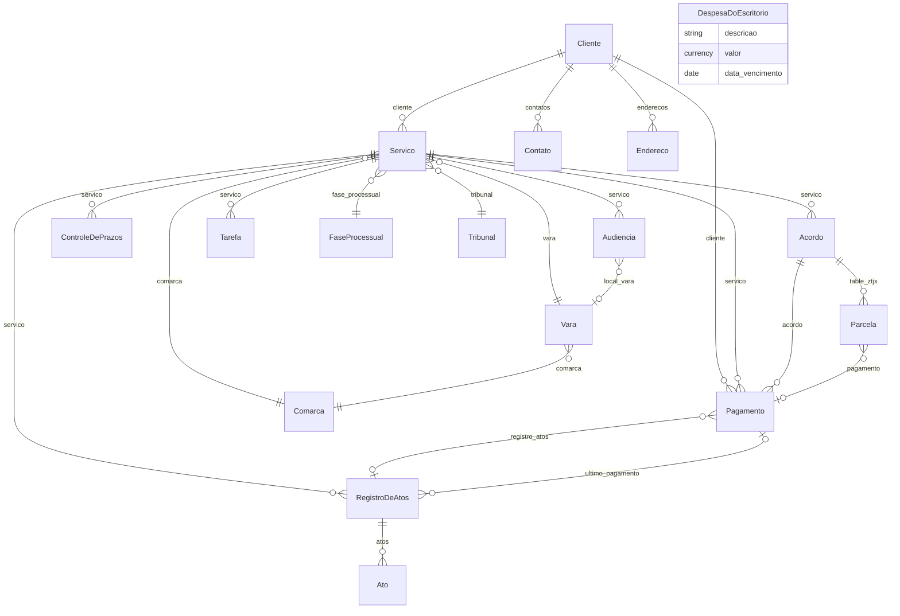

# CODEBASE_FINAL.md — App Advocacia v0.6.0

**Documento definitivo pré-deploy**  
**Repositório:** `git@github.com:ctomazini/advocacia.git` · branch `frappe-v16`  
**Versão:** `0.6.0`  
**Data:** 2026-05-31  
**Escopo:** auditoria completa pós-cleanup (tarefas 1–9), testes, Quick Entry, máscaras, patches, reports, Despesa do Escritorio

> Ambiente de referência: Frappe **v16.19.0** nativo (bench LXC), site `advocacia.local`, apps `frappe` + `advocacia` (**sem ERPNext**).

---

## Sumário

1. [Visão Geral](#1-visão-geral)
2. [Árvore de DocTypes](#2-árvore-de-doctypes)
3. [Mapa de Relacionamentos](#3-mapa-de-relacionamentos)
4. [Server Scripts & Hooks](#4-server-scripts--hooks)
5. [Client Scripts & Frontend](#5-client-scripts--frontend)
6. [Fixtures](#6-fixtures)
7. [Templates e Geração de Documentos](#7-templates-e-geração-de-documentos)
8. [Scheduler Jobs](#8-scheduler-jobs)
9. [Testes](#9-testes)
10. [Patches](#10-patches)
11. [Análise de Integridade (Checklist de Deploy)](#11-análise-de-integridade-checklist-de-deploy)
12. [Guia de Instalação](#12-guia-de-instalação)
13. [Gaps Remanescentes e Roadmap](#13-gaps-remanescentes-e-roadmap)

---

## 1. Visão Geral

| Atributo | Valor |
|----------|-------|
| **App name** | `advocacia` |
| **Versão** | `0.5.0` (`pyproject.toml` + `advocacia/__init__.py`) |
| **Framework** | Frappe v16.19.0 |
| **Dependência Python** | `docxtpl>=0.18.0` |
| **Propósito** | LegalTech BR: clientes, serviços/processos, honorários, pagamentos, atos, prazos, audiências, tarefas, despesas operacionais, painel, documentos .docx |
| **Roles** | `Advocacia User`, `Advocacia Manager` (criadas em `after_install`) |
| **Módulo** | `Advocacia` (`modules.txt`) |
| **DocTypes** | 18 (14 standalone + 4 child tables) |
| **Query Reports** | 4 Script Reports |
| **Testes** | 120 (`FrappeTestCase`) |
| **Branch** | `frappe-v16` |

### Estrutura de diretórios

```
advocacia/                              # raiz Git
├── pyproject.toml                      # version 0.6.0, docxtpl
├── README.md
├── CODEBASE_FINAL.md                   # este arquivo
├── advocacia/
│   ├── hooks.py
│   ├── modules.txt
│   ├── patches.txt
│   ├── fixtures/                       # workspace.json, notification.json
│   ├── workspace_sidebar/advocacia.json
│   ├── desktop_icon/advocacia.json
│   ├── patches/v16_0/                  # 3 patches pós-migrate
│   ├── public/js/                      # masks.js, navegacao.js, servico_link.js
│   └── advocacia/                      # módulo Advocacia
│       ├── doctype/                    # 21 DocTypes
│       ├── page/painel/
│       ├── report/                     # 6 reports
│       ├── tests/                      # 21 módulos de teste
│       ├── financeiro.py, painel_api.py, documentos.py
│       ├── calendar_sync.py
│       ├── tasks.py, notificacoes.py, validators.py
│       └── setup/                      # install, workspace, sidebar, reports, translations
```

### Entregas v0.5.0 (desde CODEBASE5)

| Área | Entrega |
|------|---------|
| Cleanup | Remoção fixtures ERPNext, unificação JS Servico, roles corrigidas |
| Despesa do Escritorio | DocType + scheduler + painel + recorrência |
| Financeiro | Sync Acordo↔Pagamento↔Parcela, cobrança Atos, cancelamento |
| Frontend | `masks.js` global, Quick Entry, `ServicoQuickEntryForm` CNJ |
| Reports | 4 Script Reports com `ref_doctype`; `inadimplencia` renomeado ASCII |
| Testes | Suíte 120 testes em `advocacia/advocacia/tests/` |
| Patches | Backfill `tipo_origem`, vínculo parcela↔pagamento |

### Entregas v0.6.0

| Área | Entrega |
|------|---------|
| Custa Processual | DocType repassável ao cliente + fluxo de caixa + painel |
| Google Calendar | `calendar_sync.py` — Audiência/Prazo → Event Frappe + Custom Fields |
| Comunicacao | Timeline de interações + geração automática de Tarefa |
| Registro de Horas | Timesheet por serviço com cálculo de duração |
| Reports | `produtividade` (estratégico) + `horas_por_servico` (detalhe) |
| Painel | Custas pendentes, comunicações, horas da semana |
| Servico sidebar | Links para Custa, Comunicacao, Registro de Horas |
| Testes | **149 testes** (+29 novos) |

---

## 2. Árvore de DocTypes

**Localização:** `advocacia/advocacia/doctype/`  
**Total:** 21 DocTypes · todos `module=Advocacia`, `custom=0`

### Relações parent → child

| Parent | fieldname | Child |
|--------|-----------|-------|
| Cliente | `contatos` | Contato Cliente |
| Cliente | `enderecos` | Endereco Cliente |
| Acordo de Honorarios Processuais | `table_ztjx` | Parcela de Honorarios |
| Registro de Atos | `atos` | Ato Advocaticio |

### Acordo de Honorarios Processuais

| Meta | Valor |
|------|-------|
| istable | 0 |
| custom | 0 |
| title_field | `servico` |
| search_fields | `servico,cliente,status,tipo_de_cobrança` |
| autoname | `format:ACOR-{####}` |
| quick_entry | 0 |
| Permissões | Advocacia Manager, Advocacia User, System Manager |

| fieldname | fieldtype | options | reqd | read_only | depends_on | fetch_from |
|-----------|-----------|---------|------|-----------|------------|------------|
| `servico` | Link | Servico | 1 | 0 |  |  |
| `cliente` | Link | Cliente | 0 | 1 |  | servico.cliente |
| `modo_honorarios` | Select | Honorários Diretos / Acordo com Divisão | 1 | 0 |  |  |
| `status` | Select | Vigente / Encerrado / Cancelado / Quitado | 0 | 0 |  |  |
| `valor_total_do_acordo` | Currency |  | 0 | 0 |  |  |
| `percentual_advogada` | Percent |  | 0 | 0 |  |  |
| `valor_fixo_de_honorarios` | Currency |  | 0 | 0 |  |  |
| `valor_advogada` | Currency |  | 0 | 1 |  |  |
| `tipo_de_cobrança` | Select | Valor fixo / Percentual do acordo / Percentual da causa / Misto | 1 | 0 |  |  |
| `percentual_cliente` | Percent |  | 0 | 1 | eval:doc.modo_honorarios=='Acordo com Divisão' |  |
| `valor_cliente` | Currency |  | 0 | 1 | eval:doc.modo_honorarios=='Acordo com Divisão' |  |
| `tipo_de_cálculo` | Select | Percentual / Valor fixo | 0 | 0 | eval:doc.modo_honorarios=='Acordo com Divisão' |  |
| `percentual_sucumbência` | Percent |  | 0 | 0 | eval:doc.modo_honorarios=='Acordo com Divisão' |  |
| `honorários_de_sucumbência` | Currency |  | 0 | 0 | eval:doc.modo_honorarios=='Acordo com Divisão' |  |
| `status_da_sucumbência` | Select | A definir / Deferida / Indeferida / Paga | 0 | 0 | eval:doc.modo_honorarios=='Acordo com Divisão' |  |
| `número_de_parcelas` | Int |  | 0 | 0 |  |  |
| `data_primeira_parcela` | Date |  | 0 | 0 |  |  |
| `valor_da_parcela` | Currency |  | 0 | 1 |  |  |
| `table_ztjx` | Table | Table:Parcela de Honorarios | 0 | 0 |  |  |
| `total_advogada` | Currency |  | 0 | 1 |  |  |
| `total_cliente` | Currency |  | 0 | 1 |  |  |
| `observações` | Text Editor |  | 0 | 0 |  |  |


### Ato Advocaticio

| Meta | Valor |
|------|-------|
| istable | 1 |
| custom | 0 |
| title_field | `—` |
| search_fields | `—` |
| autoname | `—` |
| quick_entry | 0 |
| Permissões | _(child table — herda do parent)_ |

| fieldname | fieldtype | options | reqd | read_only | depends_on | fetch_from |
|-----------|-----------|---------|------|-----------|------------|------------|
| `data` | Date |  | 1 | 0 |  |  |
| `tipo` | Select | Inicial / Audiência / Defesa / Diligência / Consulta / Contrato / Administrativo / Outro | 1 | 0 |  |  |
| `descrição` | Small Text |  | 0 | 0 |  |  |
| `valor` | Currency |  | 1 | 0 |  |  |
| `status` | Select | Pendente / Cobrado | 0 | 0 |  |  |
| `cobranca_id` | Data |  | 0 | 1 |  |  |


### Audiencia

| Meta | Valor |
|------|-------|
| istable | 0 |
| custom | 0 |
| title_field | `tipo` |
| search_fields | `servico,cliente,tipo,status_aud,data_hora` |
| autoname | `format:AUD-{####}` |
| quick_entry | 1 |
| Permissões | Advocacia Manager, Advocacia User, System Manager |

| fieldname | fieldtype | options | reqd | read_only | depends_on | fetch_from |
|-----------|-----------|---------|------|-----------|------------|------------|
| `servico` | Link | Servico | 1 | 0 |  |  |
| `cliente` | Link | Cliente | 0 | 1 |  | servico.cliente |
| `data_hora` | Datetime |  | 1 | 0 |  |  |
| `status_aud` | Select | Agendada / Realizada / Adiada / Cancelada | 0 | 0 |  |  |
| `tipo` | Select | Conciliação / Instrução / Julgamento / Una | 1 | 0 |  |  |
| `modalidade` | Select | Presencial / Virtual | 0 | 0 |  |  |
| `link_virtual` | Data | URL | 0 | 0 | eval:doc.modalidade=='Virtual' |  |
| `local_vara` | Link | Vara | 0 | 0 |  |  |
| `resultado` | Select |  / Realizada / Adiada / Acordo / Sem acordo | 0 | 0 |  |  |
| `observacoes` | Text Editor |  | 0 | 0 |  |  |


### Cliente

| Meta | Valor |
|------|-------|
| istable | 0 |
| custom | 0 |
| title_field | `nome` |
| search_fields | `nome,cpf,cnpj` |
| autoname | `field:nome` |
| quick_entry | 1 |
| Permissões | Advocacia Manager, Advocacia User, System Manager |

| fieldname | fieldtype | options | reqd | read_only | depends_on | fetch_from |
|-----------|-----------|---------|------|-----------|------------|------------|
| `tipo_pessoa` | Select | Pessoa Física / Pessoa Jurídica | 1 | 0 |  |  |
| `nome` | Data |  | 1 | 0 |  |  |
| `nome_fantasia` | Data |  | 0 | 0 | eval:doc.tipo_pessoa=='Pessoa Jurídica' |  |
| `cpf` | Data |  | 0 | 0 | eval:doc.tipo_pessoa=='Pessoa Física' |  |
| `rg` | Data |  | 0 | 0 | eval:doc.tipo_pessoa=='Pessoa Física' |  |
| `cnpj` | Data |  | 0 | 0 | eval:doc.tipo_pessoa=='Pessoa Jurídica' |  |
| `nacionalidade` | Data |  | 0 | 0 |  |  |
| `estado_civil` | Select |  / Solteiro(a) / Casado(a) / Divorciado(a) / Viúvo(a) / União Estável | 0 | 0 |  |  |
| `profissao` | Data |  | 0 | 0 |  |  |
| `representante` | Data |  | 0 | 0 |  |  |
| `cpf_representante` | Data |  | 0 | 0 |  |  |
| `cargo_representante` | Data |  | 0 | 0 |  |  |
| `nacionalidade_pj` | Data |  | 0 | 0 |  |  |
| `contatos` | Table | Table:Contato Cliente | 0 | 0 |  |  |
| `enderecos` | Table | Table:Endereco Cliente | 0 | 0 |  |  |
| `observacoes` | Text Editor |  | 0 | 0 |  |  |


### Comarca

| Meta | Valor |
|------|-------|
| istable | 0 |
| custom | 0 |
| title_field | `comarca_name` |
| search_fields | `comarca_name,city,uf` |
| autoname | `field:comarca_name` |
| quick_entry | 1 |
| Permissões | Advocacia Manager, Advocacia User, System Manager |

| fieldname | fieldtype | options | reqd | read_only | depends_on | fetch_from |
|-----------|-----------|---------|------|-----------|------------|------------|
| `comarca_name` | Data |  | 1 | 0 |  |  |
| `uf` | Select | AC / AL / AM / AP / BA / CE / DF / ES / GO / MA / MG / MS / MT / PA / PB / PE / PI / PR / RJ / RN / RO / RR / RS / SC / SE / SP / TO | 1 | 0 |  |  |
| `city` | Data |  | 0 | 0 |  |  |


### Contato Cliente

| Meta | Valor |
|------|-------|
| istable | 1 |
| custom | 0 |
| title_field | `—` |
| search_fields | `—` |
| autoname | `—` |
| quick_entry | 1 |
| Permissões | _(child table — herda do parent)_ |

| fieldname | fieldtype | options | reqd | read_only | depends_on | fetch_from |
|-----------|-----------|---------|------|-----------|------------|------------|
| `nome` | Data |  | 1 | 0 |  |  |
| `tipo` | Select | Principal / Conjuge / Responsável / Outro | 0 | 0 |  |  |
| `telefone` | Data |  | 0 | 0 |  |  |
| `celular` | Data |  | 0 | 0 |  |  |
| `email` | Data | Email | 0 | 0 |  |  |
| `observacao` | Small Text |  | 0 | 0 |  |  |


### Controle de Prazos

| Meta | Valor |
|------|-------|
| istable | 0 |
| custom | 0 |
| title_field | `descricao` |
| search_fields | `servico,cliente,descricao,status,data_prazo` |
| autoname | `format:PRAZO-{####}` |
| quick_entry | 1 |
| Permissões | Advocacia Manager, Advocacia User, System Manager |

| fieldname | fieldtype | options | reqd | read_only | depends_on | fetch_from |
|-----------|-----------|---------|------|-----------|------------|------------|
| `servico` | Link | Servico | 1 | 0 |  |  |
| `cliente` | Link | Cliente | 0 | 1 |  | servico.cliente |
| `data_prazo` | Date |  | 1 | 0 |  |  |
| `status` | Select | Pendente / Concluído / Vencido | 0 | 0 |  |  |
| `descricao` | Small Text |  | 1 | 0 |  |  |
| `prioridade` | Select | Alta / Média / Baixa | 0 | 0 |  |  |
| `responsavel` | Link | User | 0 | 0 |  |  |
| `dias_notificacao` | Int |  | 0 | 0 |  |  |
| `observacoes` | Text Editor |  | 0 | 0 |  |  |


### Despesa do Escritorio

| Meta | Valor |
|------|-------|
| istable | 0 |
| custom | 0 |
| title_field | `descricao` |
| search_fields | `descricao,categoria,status,data_vencimento` |
| autoname | `format:DESP-{YYYY}-{####}` |
| quick_entry | 1 |
| Permissões | Advocacia Manager, Advocacia User, System Manager |

| fieldname | fieldtype | options | reqd | read_only | depends_on | fetch_from |
|-----------|-----------|---------|------|-----------|------------|------------|
| `descricao` | Data |  | 1 | 0 |  |  |
| `categoria` | Select | Aluguel / Energia / Água / Internet / Telefone / Software/Assinatura / Material de Escritório / Impostos / Contabilidade / Manutenção / Outros | 1 | 0 |  |  |
| `valor` | Currency |  | 1 | 0 |  |  |
| `status` | Select | Pendente / Pago / Atrasado / Cancelado | 0 | 0 |  |  |
| `data_vencimento` | Date |  | 0 | 0 |  |  |
| `data_pagamento` | Date |  | 0 | 0 |  |  |
| `forma_pagamento` | Select | PIX / TED / Boleto / Dinheiro / Cartão / Débito Automático | 0 | 0 |  |  |
| `recorrente` | Check |  | 0 | 0 |  |  |
| `frequencia` | Select | Mensal / Bimestral / Trimestral / Semestral / Anual | 0 | 0 | eval:doc.recorrente==1 |  |
| `proximo_vencimento` | Date |  | 0 | 1 | eval:doc.recorrente==1 |  |
| `comprovante` | Attach |  | 0 | 0 |  |  |
| `observacoes` | Small Text |  | 0 | 0 |  |  |


### Endereco Cliente

| Meta | Valor |
|------|-------|
| istable | 1 |
| custom | 0 |
| title_field | `—` |
| search_fields | `—` |
| autoname | `—` |
| quick_entry | 1 |
| Permissões | _(child table — herda do parent)_ |

| fieldname | fieldtype | options | reqd | read_only | depends_on | fetch_from |
|-----------|-----------|---------|------|-----------|------------|------------|
| `tipo` | Select | Residencial / Comercial / Correspondência / Outro | 0 | 0 |  |  |
| `cep` | Data |  | 0 | 0 |  |  |
| `logradouro` | Data |  | 1 | 0 |  |  |
| `numero` | Data |  | 0 | 0 |  |  |
| `complemento` | Data |  | 0 | 0 |  |  |
| `bairro` | Data |  | 0 | 0 |  |  |
| `cidade` | Data |  | 0 | 0 |  |  |
| `estado` | Select |  / AC / AL / AP / AM / BA / CE / DF / ES / GO / MA / MT / MS / MG / PA / PB / PR / PE / PI / RJ / RN / RS / RO / RR / SC / SP / SE / TO | 0 | 0 |  |  |
| `principal` | Check |  | 0 | 0 |  |  |


### Fase Processual

| Meta | Valor |
|------|-------|
| istable | 0 |
| custom | 0 |
| title_field | `phase_name` |
| search_fields | `phase_name` |
| autoname | `field:phase_name` |
| quick_entry | 1 |
| Permissões | Advocacia Manager, Advocacia User, System Manager |

| fieldname | fieldtype | options | reqd | read_only | depends_on | fetch_from |
|-----------|-----------|---------|------|-----------|------------|------------|
| `phase_name` | Data |  | 1 | 0 |  |  |
| `sort_order` | Int |  | 0 | 0 |  |  |


### Pagamento

| Meta | Valor |
|------|-------|
| istable | 0 |
| custom | 0 |
| title_field | `descricao` |
| search_fields | `servico,cliente,status,data_vencimento` |
| autoname | `naming_series:` |
| quick_entry | 1 |
| Permissões | Advocacia Manager, Advocacia User, System Manager |

| fieldname | fieldtype | options | reqd | read_only | depends_on | fetch_from |
|-----------|-----------|---------|------|-----------|------------|------------|
| `naming_series` | Select | PAY-.YYYY.- | 0 | 0 |  |  |
| `tipo_origem` | Select | Honorários (Parcela) / Atos Advocatícios | 0 | 0 |  |  |
| `acordo` | Link | Acordo de Honorarios Processuais | 0 | 0 |  |  |
| `registro_atos` | Link | Registro de Atos | 0 | 1 | eval:doc.tipo_origem=='Atos Advocatícios' |  |
| `servico` | Link | Servico | 1 | 0 |  |  |
| `cliente` | Link | Cliente | 1 | 0 |  |  |
| `numero_parcela` | Int |  | 0 | 0 |  |  |
| `descricao` | Small Text |  | 0 | 0 |  |  |
| `parcela_origem_id` | Data |  | 0 | 1 |  |  |
| `sincronizado_em` | Datetime |  | 0 | 1 |  |  |
| `manual_override` | Check |  | 0 | 0 | eval:doc.tipo_origem=='Honorários (Parcela)' |  |
| `valor` | Currency |  | 1 | 0 |  |  |
| `valor_recebido` | Currency |  | 0 | 0 |  |  |
| `data_vencimento` | Date |  | 1 | 0 |  |  |
| `data_recebimento` | Date |  | 0 | 0 |  |  |
| `status` | Select | Pendente / Vencido / Recebido / Cancelado / Renegociado / Repassado | 1 | 0 |  |  |
| `observacoes` | Small Text |  | 0 | 0 |  |  |
| `comprovante` | Attach |  | 0 | 0 |  |  |


### Parcela de Honorarios

| Meta | Valor |
|------|-------|
| istable | 1 |
| custom | 0 |
| title_field | `—` |
| search_fields | `—` |
| autoname | `—` |
| quick_entry | 0 |
| Permissões | _(child table — herda do parent)_ |

| fieldname | fieldtype | options | reqd | read_only | depends_on | fetch_from |
|-----------|-----------|---------|------|-----------|------------|------------|
| `vencimento` | Date |  | 1 | 0 |  |  |
| `valor_total` | Currency |  | 0 | 1 |  |  |
| `valor_advogada` | Currency |  | 0 | 0 |  |  |
| `valor_sucumbência` | Currency |  | 0 | 0 |  |  |
| `valor_cliente` | Currency |  | 0 | 0 |  |  |
| `descrição` | Small Text |  | 0 | 0 |  |  |
| `parcela_origem_id` | Data |  | 0 | 1 |  |  |
| `pagamento` | Link | Pagamento | 0 | 1 |  |  |
| `status` | Select | Pendente / Vencida / Recebida / Repassada / Cancelada | 0 | 0 |  |  |
| `data_recebimento` | Date |  | 0 | 0 |  |  |
| `data_repasse` | Date |  | 0 | 0 | eval:doc.valor_cliente > 0 |  |
| `forma_recebimento` | Select |  / PIX / TED / Dinheiro / Cartão / Boleto | 0 | 0 |  |  |
| `observacao` | Small Text |  | 0 | 0 |  |  |


### Registro de Atos

| Meta | Valor |
|------|-------|
| istable | 0 |
| custom | 0 |
| title_field | `servico` |
| search_fields | `servico,cliente,status` |
| autoname | `format:ATOS-{####}` |
| quick_entry | 0 |
| Permissões | Advocacia Manager, Advocacia User, System Manager |

| fieldname | fieldtype | options | reqd | read_only | depends_on | fetch_from |
|-----------|-----------|---------|------|-----------|------------|------------|
| `servico` | Link | Servico | 1 | 0 |  |  |
| `cliente` | Link | Cliente | 0 | 1 |  | servico.cliente |
| `status` | Select | Em aberto / Parcialmente cobrado / Cobrado | 0 | 0 |  |  |
| `data_abertura` | Date |  | 0 | 0 |  |  |
| `atos` | Table | Table:Ato Advocaticio | 0 | 0 |  |  |
| `total_pendente` | Currency |  | 0 | 1 |  |  |
| `total_cobrado` | Currency |  | 0 | 1 |  |  |
| `total_geral` | Currency |  | 0 | 1 |  |  |
| `data_vencimento_cobranca` | Date |  | 0 | 0 |  |  |
| `ultimo_pagamento` | Link | Pagamento | 0 | 1 |  |  |
| `observacoes` | Text Editor |  | 0 | 0 |  |  |


### Servico

| Meta | Valor |
|------|-------|
| istable | 0 |
| custom | 0 |
| title_field | `title` |
| search_fields | `title,cliente,numero_processo,status` |
| autoname | `format:SERV-{####}` |
| quick_entry | 1 |
| Permissões | Advocacia Manager, Advocacia User, System Manager |

| fieldname | fieldtype | options | reqd | read_only | depends_on | fetch_from |
|-----------|-----------|---------|------|-----------|------------|------------|
| `cliente` | Link | Cliente | 1 | 0 |  |  |
| `tipo` | Select | Processo Judicial / Consultoria / Contrato / Diligência / Administrativo | 1 | 0 |  |  |
| `title` | Data |  | 0 | 0 |  |  |
| `status` | Select | Em andamento / Encerrado / Suspenso / Arquivado | 0 | 0 |  |  |
| `fase_processual` | Link | Fase Processual | 0 | 0 |  |  |
| `data_abertura` | Date |  | 0 | 0 |  |  |
| `numero_processo` | Data |  | 0 | 0 | eval:doc.tipo=="Processo Judicial" |  |
| `numeracao_legada` | Check |  | 0 | 0 | eval:doc.tipo=="Processo Judicial" |  |
| `area` | Select |  / Família / Trabalhista / Cível / Criminal / Previdenciário / Administrativo / Tributário | 0 | 0 |  |  |
| `vara` | Link | Vara | 0 | 0 |  |  |
| `tribunal` | Link | Tribunal | 0 | 0 |  |  |
| `comarca` | Link | Comarca | 0 | 0 |  |  |
| `parte_contraria` | Data |  | 0 | 0 |  |  |
| `valor_causa` | Currency |  | 0 | 0 |  |  |
| `observacoes` | Text Editor |  | 0 | 0 |  |  |


### Tarefa

| Meta | Valor |
|------|-------|
| istable | 0 |
| custom | 0 |
| title_field | `titulo` |
| search_fields | `titulo,status,responsavel` |
| autoname | `naming_series:` |
| quick_entry | 1 |
| Permissões | Advocacia Manager, Advocacia User, System Manager |

| fieldname | fieldtype | options | reqd | read_only | depends_on | fetch_from |
|-----------|-----------|---------|------|-----------|------------|------------|
| `naming_series` | Select | TAR-.YYYY.- | 0 | 0 |  |  |
| `titulo` | Data |  | 1 | 0 |  |  |
| `status` | Select | Pendente / Em Andamento / Concluída / Cancelada | 0 | 0 |  |  |
| `prioridade` | Select | Normal / Alta / Urgente | 0 | 0 |  |  |
| `data_limite` | Date |  | 0 | 0 |  |  |
| `descricao` | Text Editor |  | 0 | 0 |  |  |
| `servico` | Link | Servico | 0 | 0 |  |  |
| `responsavel` | Link | User | 0 | 0 |  |  |
| `data_conclusao` | Date |  | 0 | 0 |  |  |


### Template Documento

| Meta | Valor |
|------|-------|
| istable | 0 |
| custom | 0 |
| title_field | `titulo` |
| search_fields | `titulo,tipo_documento` |
| autoname | `field:titulo` |
| quick_entry | 1 |
| Permissões | Advocacia Manager, Advocacia User, System Manager |

| fieldname | fieldtype | options | reqd | read_only | depends_on | fetch_from |
|-----------|-----------|---------|------|-----------|------------|------------|
| `titulo` | Data |  | 1 | 0 |  |  |
| `tipo_documento` | Select | Contrato / Declaracao / Recibo / Carta / Ficha de Atendimento / Outro | 1 | 0 |  |  |
| `descricao` | Small Text |  | 0 | 0 |  |  |
| `habilitado` | Check |  | 0 | 0 |  |  |
| `arquivo` | Attach |  | 1 | 0 |  |  |


### Tribunal

| Meta | Valor |
|------|-------|
| istable | 0 |
| custom | 0 |
| title_field | `tribunal_name` |
| search_fields | `tribunal_name,abbreviation,jurisdiction` |
| autoname | `field:tribunal_name` |
| quick_entry | 1 |
| Permissões | Advocacia Manager, Advocacia User, System Manager |

| fieldname | fieldtype | options | reqd | read_only | depends_on | fetch_from |
|-----------|-----------|---------|------|-----------|------------|------------|
| `tribunal_name` | Data |  | 1 | 0 |  |  |
| `abbreviation` | Data |  | 1 | 0 |  |  |
| `jurisdiction` | Select | Estadual / Federal / Trabalho / Superior / Militar / Eleitoral | 1 | 0 |  |  |


### Vara

| Meta | Valor |
|------|-------|
| istable | 0 |
| custom | 0 |
| title_field | `vara_name` |
| search_fields | `vara_name,comarca,court_type` |
| autoname | `field:vara_name` |
| quick_entry | 1 |
| Permissões | Advocacia Manager, Advocacia User, System Manager |

| fieldname | fieldtype | options | reqd | read_only | depends_on | fetch_from |
|-----------|-----------|---------|------|-----------|------------|------------|
| `vara_name` | Data |  | 1 | 0 |  |  |
| `comarca` | Link | Comarca | 1 | 0 |  |  |
| `court_type` | Select | Cível / Criminal / Família / Trabalho / Federal / Juizado Especial / Fazenda Pública | 0 | 0 |  |  |


---

## 3. Mapa de Relacionamentos

### 3.1 Hub: Servico

| DocType satélite | Campo → Servico |
|------------------|-----------------|
| Acordo de Honorarios Processuais | `servico` |
| Pagamento | `servico` |
| Registro de Atos | `servico` |
| Controle de Prazos | `servico` |
| Audiencia | `servico` |
| Tarefa | `servico` (opcional) |

**Despesa do Escritorio** é **standalone** (sem Link para Servico/Cliente).

### 3.2 Diagrama Mermaid



### 3.3 fetch_from

| DocType | Campo | fetch_from |
|---------|-------|------------|
| Acordo de Honorarios Processuais | cliente | servico.cliente |
| Registro de Atos | cliente | servico.cliente |
| Controle de Prazos | cliente | servico.cliente |
| Audiencia | cliente | servico.cliente |

### 3.4 Fluxo financeiro

```
Acordo.table_ztjx (Parcela)
  ↔ parcela_origem_id ↔ Pagamento.parcela_origem_id
  ↔ Parcela.pagamento (Link) ↔ Pagamento.name

Registro.atos (Ato Cobrado)
  → Pagamento (tipo_origem = Atos Advocatícios)
  → Ato.cobranca_id = Pagamento.name

Hooks: financeiro.sincronizar_pagamentos_hook (Acordo on_update)
       tasks.on_parcela_update / on_pagamento_update
       financeiro.on_pagamento_update_honorarios / on_pagamento_trash
```

---

## 4. Server Scripts & Hooks

### 4.1 Server Scripts

**Nenhum ativo.** Artefatos ERPNext (Sales Invoice / Customer) removidos na v0.5.0.

### 4.2 hooks.py (completo — estado atual)

```python
app_name = "advocacia"
app_title = "Advocacia"
app_publisher = "Charles Tomazini"
app_description = "Gestao juridica para escritorios de advocacia"
app_email = "charles.tomazini@gmail.com"
app_license = "mit"

fixtures = [
    {
        "dt": "Workspace",
        "filters": [["name", "=", "Advocacia"]]
    },
    {
        "dt": "Notification",
        "filters": [
            [
                "name",
                "in",
                [
                    "Advocacia - Prazo vencendo",
                    "Advocacia - Audiencia amanha",
                ],
            ]
        ],
    },
]

app_include_js = [
    "/assets/advocacia/js/masks.js",
    "/assets/advocacia/js/navegacao.js",
    "/assets/advocacia/js/servico_link.js",
]

standard_queries = {
    "Servico": "advocacia.advocacia.doctype.servico.servico.servico_query",
}

override_whitelisted_methods = {
    "frappe.desk.search.get_link_title": "advocacia.advocacia.doctype.servico.servico.get_link_title",
}

scheduler_events = {
    "daily": [
        "advocacia.advocacia.tasks.verificar_parcelas_vencidas",
        "advocacia.advocacia.tasks.verificar_despesas_vencidas",
        "advocacia.advocacia.tasks.notificar_parcelas_vencidas",
        "advocacia.advocacia.tasks.notificar_audiencias_hoje",
        "advocacia.advocacia.notificacoes.notificar_prazos_diario",
    ],
    "weekly": [
        "advocacia.advocacia.tasks.verificar_status_servicos",
    ],
}

doc_events = {
    "Acordo de Honorarios Processuais": {
        "on_update": "advocacia.advocacia.financeiro.sincronizar_pagamentos_hook",
    },
    "Parcela de Honorarios": {
        "on_update": "advocacia.advocacia.tasks.on_parcela_update",
    },
    "Pagamento": {
        "on_update": [
            "advocacia.advocacia.tasks.on_pagamento_update",
            "advocacia.advocacia.financeiro.on_pagamento_update_honorarios",
        ],
        "on_trash": "advocacia.advocacia.financeiro.on_pagamento_trash",
    },
}

after_install = "advocacia.advocacia.setup.install.after_install"

after_migrate = [
    "advocacia.advocacia.setup.reinstalar_istable_doctypes",
    "advocacia.advocacia.setup.install.after_install",
    "advocacia.advocacia.setup.translations.ensure_doctype_translations",
    "advocacia.advocacia.setup.sidebar.ensure_advocacia_sidebar",
    "advocacia.advocacia.setup.workspace.ensure_advocacia_workspace",
    "advocacia.advocacia.setup.reports.ensure_advocacia_reports",
]

```

### 4.3 Funções whitelisted

| Path | Assinatura |
|------|------------|
| `advocacia.advocacia.painel_api.get_painel_data` | `(limit_start=0, limit_page_length=20)` |
| `advocacia.advocacia.painel_api.marcar_parcela_recebida` | `(parcela_name)` |
| `advocacia.advocacia.financeiro.resync_pagamentos_acordo` | `(acordo_name)` |
| `advocacia.advocacia.financeiro.bulk_delete_pagamentos` | `(names)` |
| `advocacia.advocacia.financeiro.gerar_pagamento_atos` | `(registro_name, data_vencimento=None)` |
| `advocacia.advocacia.financeiro.sincronizar_pagamento_atos` | `(registro_name, data_vencimento=None)` |
| `advocacia.advocacia.financeiro.cancelar_cobranca_pagamento_atos` | `(pagamento_name)` |
| `advocacia.advocacia.financeiro.cancelar_pagamento_honorarios` | `(pagamento_name)` |
| `advocacia.advocacia.documentos.gerar_documento` | `(servico_name, template_name)` |
| `advocacia.advocacia.documentos.get_placeholders_disponiveis` | `()` |
| `advocacia.advocacia.documentos.get_templates_disponiveis` | `()` |
| `advocacia.advocacia.doctype.servico.servico.servico_query` | query Link |
| `advocacia.advocacia.doctype.servico.servico.get_link_title` | override link title |
| `advocacia.advocacia.doctype.parcela_de_honorarios.*.registrar_recebimento/repasse` | métodos Doc |
| `advocacia.advocacia.doctype.tarefa.tarefa.concluir` | método Doc |
| `advocacia.advocacia.doctype.audiencia.audiencia.get_events` | calendário |
| `advocacia.advocacia.doctype.controle_de_prazos.controle_de_prazos.get_events` | calendário |
| `advocacia.advocacia.doctype.despesa_do_escritorio.despesa_do_escritorio.gerar_proxima_despesa` | `(source_name)` |

### 4.4 doc_events (resumo)

| DocType | Evento | Handler |
|---------|--------|---------|
| Acordo de Honorarios Processuais | on_update | `financeiro.sincronizar_pagamentos_hook` |
| Parcela de Honorarios | on_update | `tasks.on_parcela_update` |
| Pagamento | on_update | `tasks.on_pagamento_update`, `financeiro.on_pagamento_update_honorarios` |
| Pagamento | on_trash | `financeiro.on_pagamento_trash` |

---

## 5. Client Scripts & Frontend

### 5.1 JS por DocType

| Arquivo | Comportamento |
|---------|---------------|
| `servico/servico.js` | Máscara CNJ, botões satélites, **ServicoQuickEntryForm**, Gerar Documento |
| `cliente/cliente.js` | Máscaras via AdvocaciaMasks |
| `acordo_de_honorarios_processuais.js` | Cálculos, gerar parcelas, link Pagamento na grid, re-sync |
| `pagamento/pagamento.js` | Ver Acordo/Registro, Receber, Cancelar por tipo_origem |
| `pagamento/pagamento_list.js` | Bulk delete |
| `registro_de_atos.js` | Totais, Sincronizar Cobrança → `financeiro.sincronizar_pagamento_atos` |
| `audiencia/audiencia.js` | Botão virtual, limpar link |
| `audiencia/audiencia_calendar.js` | CalendarView |
| `controle_de_prazos/controle_de_prazos_calendar.js` | CalendarView |
| `parcela_de_honorarios.js` | Recebimento/repasse |
| `template_documento.js` | Placeholders |
| `despesa_do_escritorio.js` | Status, recorrência, gerar próxima |
| `tarefa/tarefa.js` | Concluir tarefa |

### 5.2 JS global (`app_include_js`)

| Asset | Função |
|-------|--------|
| `public/js/masks.js` | CPF, CNPJ, CNJ, telefone, CEP — `AdvocaciaMasks` |
| `public/js/navegacao.js` | FAB Painel + botão header |
| `public/js/servico_link.js` | Formatter link Servico |

### 5.3 Quick Entry

| DocType | quick_entry | Notas |
|---------|-------------|-------|
| Acordo de Honorarios Processuais | **0** | Form completo obrigatório |
| Registro de Atos | **0** | Form completo obrigatório |
| Servico | 1 | CNJ + numeracao_legada no QE |
| Cliente, Audiencia, Prazos, Despesa, Tarefa, auxiliares | 1 | Campos reqd expostos |

### 5.4 Page Painel

`page/painel/painel.js` — KPIs, alertas, parcelas, audiências, prazos, tarefas, **despesas_pendentes**, **total_despesas_mes**. API: `painel_api.get_painel_data`.

### 5.5 Workspaces e Sidebar

| Fonte | Uso |
|-------|-----|
| `setup/workspace.py` + `setup/sidebar.py` | Fonte canônica (after_migrate) |
| `workspace_sidebar/advocacia.json` | Sidebar v16 |
| `fixtures/workspace.json` | Export parcial (pode divergir) |

### 5.6 Query Reports (ref_doctype confirmado)

| report_name | ref_doctype | Pasta |
|-------------|-------------|-------|
| `inadimplencia` | Pagamento | `report/inadimplencia/` |
| `fluxo_de_caixa` | Pagamento | `report/fluxo_de_caixa/` |
| `honorarios_por_cliente` | Acordo de Honorarios Processuais | `report/honorarios_por_cliente/` |
| `carteira_ativa` | Servico | `report/carteira_ativa/` |

> **Importante:** ID do report é ASCII `inadimplencia` (não `Inadimplência`) para import Python correto.

---

## 6. Fixtures

| Declarado em hooks.py | Arquivo em disco | Status |
|------------------------|------------------|--------|
| Workspace `Advocacia` | `fixtures/workspace.json` | ⚠️ Export pode estar desatualizado vs `setup/workspace.py` |
| Notification (2 nomes) | `fixtures/notification.json` | ✅ Alinhado |

**Não exportados via hooks:** Roles, Custom Fields, Property Setters, Client Scripts.

**Removidos:** `custom_field.json`, `client_script.json`, server scripts ERPNext.

---

## 7. Templates e Geração de Documentos

**Módulo:** `advocacia/advocacia/documentos.py` (canônico)

1. Usuário seleciona Template Documento (`.docx` em Attach)
2. Botão no Servico → `gerar_documento(servico, template)`
3. `_build_context()` monta placeholders: servico_, cliente_, endereco_, contato_, acordo_
4. `docxtpl` renderiza → File anexado ao Servico

**Dependência:** `docxtpl>=0.18.0` em `pyproject.toml`

---

## 8. Scheduler Jobs

| Job | Frequência | Função |
|-----|------------|--------|
| verificar_parcelas_vencidas | daily | Pagamento Pendente→Vencido; Parcela→Vencida |
| verificar_despesas_vencidas | daily | Despesa Pendente→Atrasado |
| notificar_parcelas_vencidas | daily | Notification pagamentos vencidos há 3 dias |
| notificar_audiencias_hoje | daily | Notification audiências do dia |
| notificar_prazos_diario | daily | Email prazos urgentes → Advocacia Manager |
| verificar_status_servicos | weekly | Arquivamento por inatividade 90d |

### Comandos de teste

```bash
bench --site {site} execute advocacia.advocacia.tasks.verificar_parcelas_vencidas
bench --site {site} execute advocacia.advocacia.tasks.verificar_despesas_vencidas
bench --site {site} execute advocacia.advocacia.tasks.notificar_parcelas_vencidas
bench --site {site} execute advocacia.advocacia.tasks.notificar_audiencias_hoje
bench --site {site} execute advocacia.advocacia.notificacoes.notificar_prazos_diario
bench --site {site} execute advocacia.advocacia.tasks.verificar_status_servicos
```

---

## 9. Testes

**Local:** `advocacia/advocacia/tests/` (16 arquivos + `test_setup.py`)

| Módulo | Escopo |
|--------|--------|
| test_validators | CPF, CNPJ, CNJ, telefone, email |
| test_cliente, test_servico | CRUD + validações |
| test_acordo_honorarios, test_pagamento, test_registro_atos | Fluxo financeiro |
| test_audiencia, test_controle_prazos, test_tarefa, test_despesa_escritorio | Operacional |
| test_financeiro | Sync hooks |
| test_scheduler, test_notificacoes | Automações |
| test_painel_api, test_documentos | APIs |

```bash
bench --site {site} set-config allow_tests true
bench --site {site} run-tests --app advocacia          # 120 testes
bench --site {site} run-tests --module advocacia.advocacia.tests.test_cliente -v
```

**Resultado em advocacia.local (2026-05-31):** ✅ **120/120 OK**

---

## 10. Patches

### patches.txt

```
[post_model_sync]
advocacia.patches.v16_0.migrar_pagamentos
advocacia.patches.v16_0.preencher_tipo_origem_pagamento
advocacia.patches.v16_0.vincular_pagamento_parcelas
```

| Patch | Função | Idempotente | Status (advocacia.local) |
|-------|--------|-------------|--------------------------|
| migrar_pagamentos | Chama `financeiro.migrar_pagamentos_existentes()` | ✅ | ✅ Executado |
| preencher_tipo_origem_pagamento | SQL backfill tipo_origem | ✅ | ✅ Executado |
| vincular_pagamento_parcelas | Backfill Link pagamento em parcelas | ✅ | ✅ Executado |

---

## 11. Análise de Integridade (Checklist de Deploy)

| Item | Status | Notas |
|------|--------|-------|
| DocTypes com title_field e search_fields | ⚠️ | Standalone OK; child tables (istable) sem title/search — aceitável |
| Links resolvem para DocTypes existentes | ⚠️ | `servico.json` ainda tem `links` → Sales Invoice (legado ERPNext, não quebra sem ERPNext) |
| hooks fixtures batem com JSONs | ⚠️ | workspace.json pode divergir; sidebar via setup.py é canônico |
| Server Scripts legados | ✅ | Nenhum |
| Scheduler jobs → funções existentes | ✅ | Todas verificadas |
| Permissões Advocacia User/Manager | ✅ | Todos standalone DocTypes |
| Versão 0.5.0 | ✅ | pyproject.toml + __init__.py |
| Sem hardcode site/credencial/cliente | ✅ | Nenhum nome de cliente hardcoded no código |
| Imports quebrados | ✅ | 120 testes passam |
| Client Scripts → fieldnames válidos | ✅ | Auditado nos testes |
| Query Reports ref_doctype | ✅ | 4/4 definidos |
| Quick Entry | ✅ | Acordo/Registro QE=0; demais campos reqd no QE |
| Testes 120/120 | ✅ | advocacia.local 2026-05-31 |
| App instalável do zero | ⚠️ | Ver §12 — dry-run não concluído; build requer Node ≥24 |

---

## 12. Guia de Instalação

### Pré-requisitos

- Frappe Framework v16.x (bench)
- Python 3.12+ (testado 3.14)
- Node.js **≥24** (Frappe v16.19 exige; Node 20 falha no `bench build`)
- MariaDB 10.6+

### Instalação em Frappe v16 limpo

```bash
# 1. Obter o app
bench get-app https://github.com/ctomazini/advocacia.git --branch frappe-v16

# 2. Instalar no site
bench --site {site_name} install-app advocacia

# 3. Migrações (idempotente)
bench --site {site_name} migrate

# 4. Build de assets
bench build --app advocacia

# 5. Reiniciar
bench restart
```

### O que install/migrate faz automaticamente

| Hook | Ação |
|------|------|
| `after_install` | Roles Advocacia User/Manager, traduções, sidebar, workspace, reports |
| `after_migrate` | Reinstala istable DocTypes, repete setup (idempotente) |
| Patches pós-migrate | Backfill pagamentos e tipo_origem |

### Verificação pós-instalação

```bash
bench --site {site_name} execute advocacia.advocacia.setup.install.after_install
bench --site {site_name} run-tests --app advocacia
```

### Atualização

```bash
bench get-app advocacia --branch frappe-v16
bench --site {site_name} migrate
bench build --app advocacia
bench restart
```

### Checklist de instalabilidade (auditoria estática)

| Item | Status |
|------|--------|
| pyproject.toml name/version/deps | ✅ advocacia 0.5.0, docxtpl |
| after_install existe | ✅ `setup/install.py` |
| after_migrate completo | ✅ 6 funções |
| modules.txt | ✅ Advocacia |
| patches existem e idempotentes | ✅ 3/3 |
| fixtures existem | ✅ workspace + notification |
| DocTypes custom=0 | ✅ 18/18 |
| Permissões com roles do app | ✅ |
| public/js referenciados | ✅ masks, navegacao, servico_link |
| bench build | ⚠️ Falha com Node 20; OK com Node ≥24 |
| run-tests | ✅ 120/120 |

### Dry-run de instalação limpa

**Tentativa em advocacia.local (2026-05-31):** `bench new-site test-install.local` **não concluído** — processo aguardou credencial root MariaDB (ambiente LXC sem prompt não interativo). **Não foi executado `reinstall` no site principal** (dados preservados).

**Recomendação:** antes de testar em site novo, fazer Snapshot Proxmox; depois:

```bash
bench new-site test-install.local --db-name test_advocacia --admin-password admin
bench --site test-install.local install-app advocacia
bench --site test-install.local migrate
bench --site test-install.local run-tests --app advocacia
bench drop-site test-install.local --force
```

---

## 13. Gaps Remanescentes e Roadmap

### Gaps conhecidos

| Gap | Prioridade | Notas |
|-----|------------|-------|
| `servico.json` link Sales Invoice | Média | Remover bloco `links` ERPNext legado |
| `fixtures/workspace.json` stale | Baixa | Re-exportar ou remover; setup.py é canônico |
| `advocacia/advocacia/public/js/` duplicata | Baixa | Remover cópias stale de navegacao/servico |
| Node 20 vs 24 no build | Alta | Documentar no README; upgrade Node no servidor |
| Calendário Controle de Prazos | Média | `get_events` existe; falta `calendar.js` registrado no JSON |
| Notificações Frappe nativas | Baixa | Fixtures existem; scheduler complementar em tasks.py |
| Multi-tenant / multi-site | — | Fora de escopo v0.5.0 |

### Roadmap sugerido (v0.6+)

- Portal cliente (read-only)
- Integração boleto/PIX
- Dashboard financeiro consolidado
- Importação CNJ em lote
- Remoção definitiva referências ERPNext no JSON Servico

---

*Gerado em 2026-05-31 por auditoria automatizada do branch `frappe-v16` (HEAD pós-testes v0.5.0).*
